What does collaborative editing look like?  
协同编辑是什么样的？

As developers, you will probably think of Git. You make changes to your document, someone else makes changes on their document, you merge, and then one of you fixes conflicts.  
作为一个开发者，你可能会想到Git。你对你的文档进行修改，其他人对他们的文档进行修改，你们合并，然后其中的一个人解决冲突。

Part of that process is great. You can just make changes without having to wait for anyone else. That is called making changes optimistically, in the sense that you can do stuff without having to tell other people first and assume that your changes will come through.  
这个过程中的一部分非常棒，你无需等待其他人就可以进行修改。这就是所谓的乐观地进行修改，在某种意义上，你假设你的修改会成功，而无需告诉其他人。

Part of that process is not great. When you and I are editing the same document at the same time, we do not want to be interrupted every few minutes to deal with conflicts. A text editor that worked like that would be unusable. But conflicts do not constantly happen. They only happen when we try to edit the same place at the same time, which is not common.  
这个过程中的另一个部分不太好，当你和我同时编辑同一个文档时，我们不想每隔几分钟就被处理冲突所打扰。这种情况下编辑器将变的无法使用。但是冲突并不会经常发生，它仅会发生在同时编辑同一个位置，这并不常见。

When a conflict does happen, though, what if we were not bugged about it? The system could make its best guess on what to do, and one of us could fix it if it was wrong. In theory, this seems like a terrible idea that could never work. In practice, it mostly does work.  
不过，当有冲突时，我们要是没能解决问题呢？系统最好可以猜测到该怎么做，如果它是错的，我们可以修复它。理论上，这看起来像一个永远行不通的糟糕想法。实际上，它完全行得通。

So how does this work in practice? The system doesn’t need to be right, it just has to be consistent, and it needs to try to keep your intent.  
所以如何让它在实际中工作呢？系统不需要是正确的，它只需要一致，和尝试去保留你的意图。

The image below shows this. If I type in the word “hello,” the system should do its very best to make sure “hello” ends up in the document somewhere. That is intent.  
下面这张图片显示了这一点，如果我输入“hello”，最终系统应该尽力保证“hello”在文档的某个位置，这是它的意图。

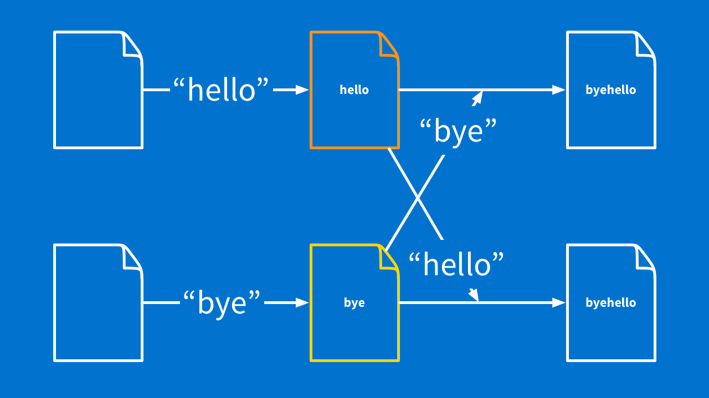

And if someone else types “bye” at the same spot at the same time? Our two documents should eventually end up exactly the same, whether that is “hellobye” or “byehello” — the documents need to be consistent.  
如果同时另一个人在同一个位置输入“bye”？我们的两个文档最终应该完全相同，不管它是“hellobye”还是“byehello” - 文档需要一致

What about conflicts? Well, people are kind of natural conflict resolution machines. If you are walking down the hallway, and someone is about to walk into you, you will stop. Probably both of you will move to the same side. And then maybe you will both move to the other side and you will laugh. But then eventually one of you will move, and the other will stand still, and everything will work out.  
冲突呢？好吧，人类是一个天然解决问题的机器。如果你在走走廊，某人即将走到你身边，你会停止。你俩可能会走向同一边，然后又同时走向另一边，然后一起笑。但是最后你们其中一个会移动，而另一个站着不动，最后问题迎刃而解。

So, you want your editor to quickly respond to the person using it. If you are typing, you do not want to wait for a network request before you can see what you typed. And you want the other people editing your document to see your changes. And you want to do all of this as fast as possible. How could you make that work?  
所以，你希望你的编辑器对使用者做出迅速的响应。如果你正在尝试，你不希望你等待一个网络请求结束后才能看到你输入的内容。并且你希望其他人也可以看到你正在对文档编辑的内容，最后你希望尽可能快递完成这些工作。那么你该怎么样做？

The first thing you might think of is sending diffs, like the image below. “This person 1 changed line 5 from this to this.” But it is hard to see intent in a diff. All diffs do is tell you what changed, not why.  
你可能想到的第一件事是发送一些差异，像下面的图片。“用户A对第5行进行了修改”。但是我们很难从中看出这次差异的意图。所有的差异仅仅告诉你哪里进行了变化，而不是为什么。

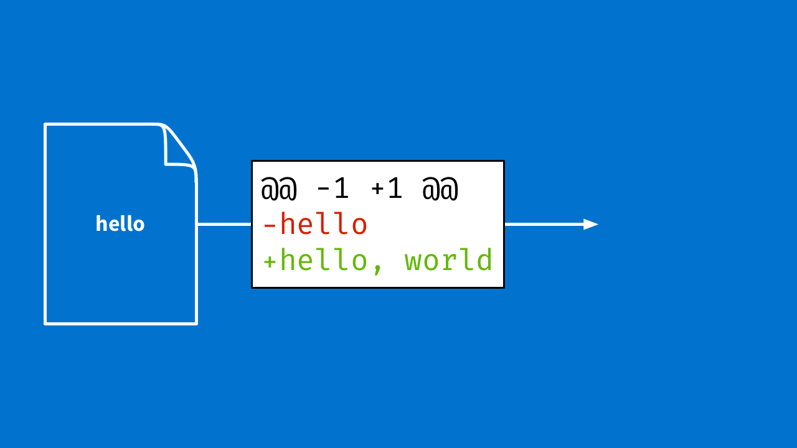

A better way is to think in terms of actions a person could take: “I inserted character ‘a’ at position 5.” “I deleted character ‘b’ after position 8.”  
更好的方式是根据一个人的行为去思考：“我在位置5插入了一个字符'a'”，“我在位置8后面删除了一个字符'b'”。

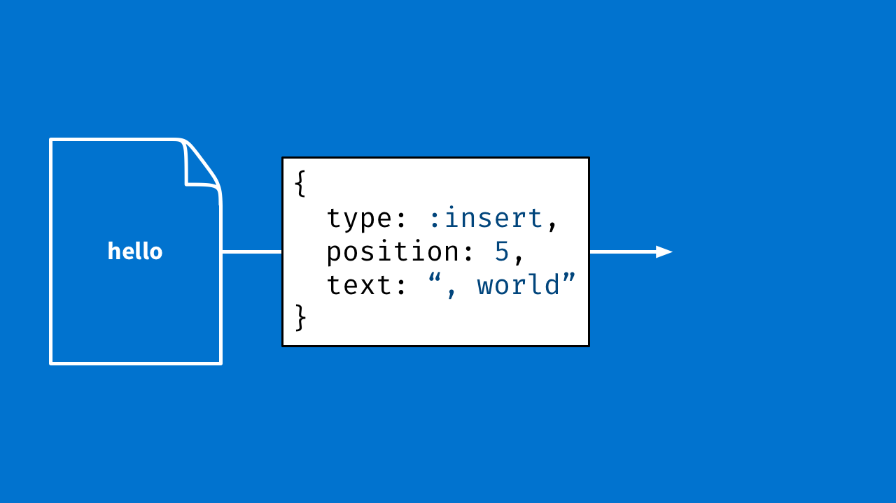

You can make these actions (or operations) pretty much whatever you want. Everything from “insert some text” to “make this section of text bold.” You can apply these to a document, and when you do, the document changes. So, as you can see below, applying this operation changes “Hello” to “Hello, world.”  
你可以随意的执行这些行为（或操作）。从“插入一些文本”到“让这段文本变粗”。你可以将它们应用于文档，然后，文档就会改变。所以，如下所示，应用这个操作会将“Hello”修改为“Hello, world.”

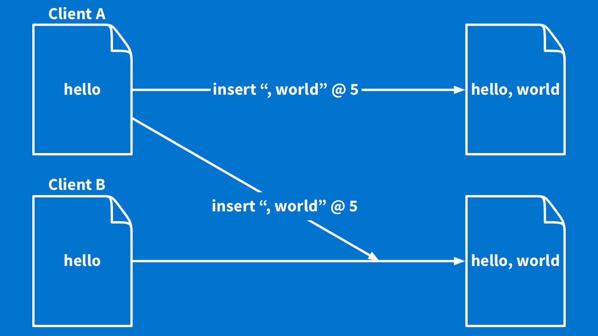

If we have operations, and we can send operations, and we can change documents by applying operations, then we almost have collaboration.  
如果我们有了这些操作、发送它们，并且应用它们修改文档，那么我们几乎就实现了协作。

What if client A sent an “insert ‘world’ at 5” operation to client B? Client B could apply that operation, and you would have the same doc! Bingo — job is finished and it is perfect. Except it is not.  
如果客户端A发送了一个“在位置5插入'world'”的操作到客户端B，我们将怎样做？客户端B可以引用这个操作，然后我们就可以用户同样的文档。Bingo - 完成工作，完美~！但是事实并非如此。

Because remember — you could both be changing the document at the same time. So, let’s say you have two clients. They each have a document with the text “at” as shown below.  
要知道 - 你们可以同时更改这个文档。所以，让我们假设你有两个客户端。如下所示，它们各自拥有一个“at”的文本文档

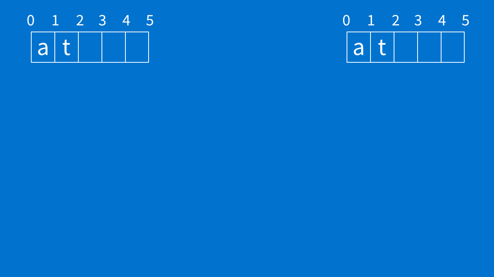

Now, the left client types “c” at position 0, making the word “cat.” At the same time, the other client types “r” at position 1, making the word “art.”  
现在，左边的客户端在位置0输入“c”，让这个词变为“cat”。同时，另一个客户端在位置1输入“r”，让这个词变为“art”

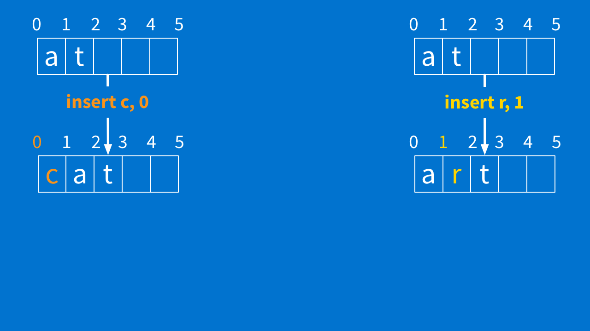

Now, the client on the right gets this “insert c at 0” operation from the other client and ends up with “cart.” So far, so good. But then the client on the left gets the “insert r at 1” operation from the other client, ending up with the “crat” you see below.  
现在，右边的客户端从其它客户端那获取到“在位置0插入'c'”这个操作，最终文档变成“cart”。到目前位置还挺好。但是左边的客户端从其它客户端那获取到“在位置1插入't'”这个操作，最终文档变成“crat”，如下所示。

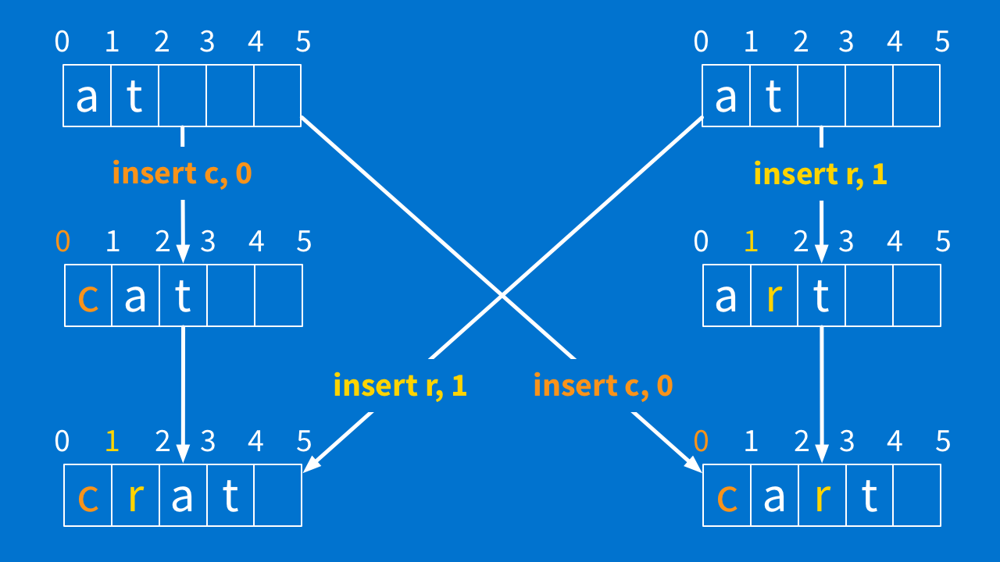

And I have no idea what a “crat” is. (Do you?)  
我不知道“crat”是什么。（你呢？）

Worse than the unknown “crat,” we have violated one of our most important rules. Both documents need to be consistent with one another — they need to end up at the same state. Because now, if the client on the left deletes the character “a” after position 2, it also deletes “r” on this other client without having any idea that it is doing it. It is wrong and broken in a way a person cannot fix.  
比这个“cart”更糟糕，我们违反一个最重要的规则，两个文档必须一致 - 它们最终需要是同一个状态。因为现在，如果左侧客户端在位置2后面删除了一个字符“a”。他会在不知情的情况下删除了其它客户端上面的“r”。这是错误，并且以一种无法修复的方式损坏。

So, something else needs to happen. And that something is operational transformation.  
所以，需要发生另外一些事情。那就是“operational transformation”。

Transforming operations

So let’s look at the problem again. We have two operations that happen at the same time, meaning they both came from the same document state — the “at” example we talked about earlier.  
让我们再一次观察这个问题。我们同时发生了两个操作，意味着他们来自同一个文档状态 - 我们之前提到的“at”示例


Whenever we have two operations that happen on the same exact document, that means we might need to change one of them. This is because you can only make changes one after the other, in order — like we just saw with “cart” and “crat,” order matters. On this client, it means that the insert “r” has to change so that it can happen after the insert “c.” So what would this look like?  
每当我们在一个完全相同的文档上进行两次操作时，这意味着我们需要更改其中的一个。这是因为你只能让修改按照顺序一个接一个的进行 - 就像我们刚刚看到的“cart”和“crat”一样，排序很重要。在这个客户端上，它意味着插入“r”这个操作应该发生在插入“c”这个操作后面。那会是什么样呢？

Well, after you insert “c,” the old position 1 (highlighted in yellow below) is now position 2. Everything moved over by one. If the “r” goes in between “a” and “t” (just like it did over on the other client), it should go into position 2 — right? So, when you get that “insert r at 1,” you transform it into “insert r at 2” before you apply it.  
好吧，在你插入“c”之后，原来的位置1（下图以黄色高亮显示）是现在的位置2。如果这个“r”在“a”和“t”之间（就像它在另一个客户端所做的一样），它应该进入到位置2中 - 对吧？所以，当获得这个“在位置1插入'r'”的操作之后，你应该在应用它之前转换为”在位置2插入'r'“

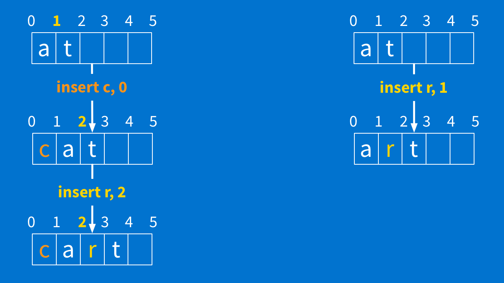

How about on the other side? It gets “insert c at 0.” But position 0 has not moved, so “insert c at 0” can just stay as it is.  
另一边呢？它获得”在位置0插入'c'“，但是位置0没有移动，所以”在位置0插入'c'“可以保持原样

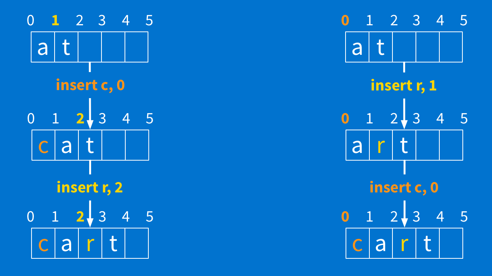

What you are trying to do is say, “If operation A and operation B happened at the same time, how could I change operation B to adjust for what operation A did?”  
你想说的是”如果操作A和操作B同时发生，我该如何根据操作A去调整操作B？“

That can sometimes be abstract and hard to think about. So I draw boxes instead. (Yep, I have lots of pieces of paper filled with boxes.) But check this out below. In the upper-left corner, I write a document state — “at.”  
有时这会很抽象，并且难以思考。所以我画了个方框。（是的，我有很多画满方框的纸）看看下面这个，在左上角，我写了一个文档状态“at”。


I draw an arrow going right and I write one of the operations (“insert c at 0”) on it. Then in the upper-right, I write what things look like after that happens (“cat”). Then I draw a line going down.  
我画了一个箭头指向右边，并且在它上面写了一个“在位置0插入‘c’”的操作。然后在右上角，我写了这个操作发生之后的样子（“cat”）。然后我往下画了条线。

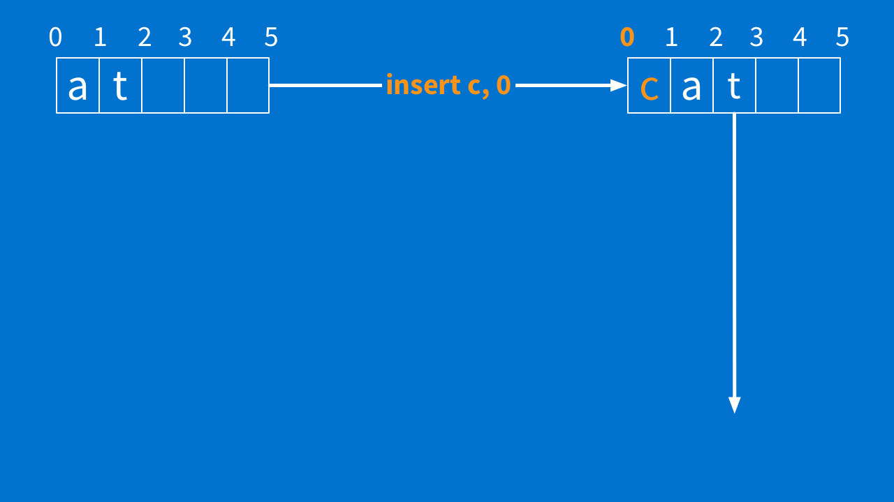

Next, I draw an arrow going down. This one gets the other operation (“insert r at 1”). Same as before: I write down what things look like after that happens (“art”). And I draw an arrow going right. We end up with what you see below.  
接下来，我花了一个箭头指向下面。它是获取到另一个操作（“在位置1插入‘r’”）。和之前一样：我写了这个操作发生之后的样子（“art”）。并且我画了个箭头指向右边。我们最终看到下面的样子。

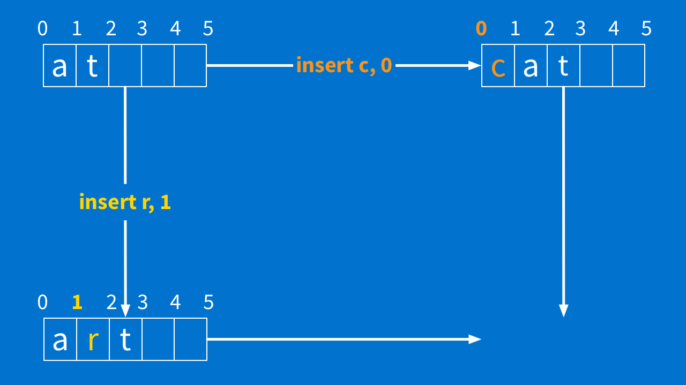

Now we have a decision to make. In the lower right-hand corner, what should the document look like? This is where thinking about what your user would expect can help, but sometimes you have to just make a decision.  
现在我们做了一个决定。在右下角，文档应该是什么样子？这时去思考你的用户期望看到什么会对你有所帮助，但是有时你必须做决定。

Here, though, the answer is not ambiguous — it should be “cart.” What would need to happen to turn “cat” into “cart”? “Insert r at 2.” What would need to happen to turn “art” into “cart”? “Insert c at 0.” So we will fill in the blank arrows. Those two arrows are our two transformed operations.  
虽然这里回答是明确的 - 它应该是“cart”。该怎样去做才会让“cat”变成“cart”？“在位置2插入‘r’”。该怎样去做才会让“art”变为“cart”？“在位置0插入‘c’”。所以我们将填上这两个空白箭头，这两个箭头就是我们的转换的操作。

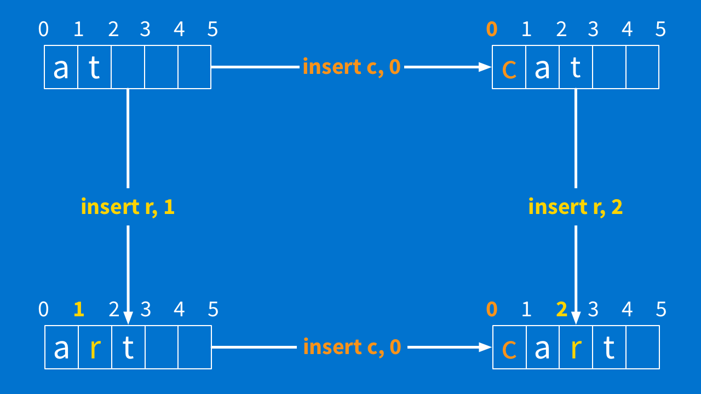

Once you know this, it is really easy to test drive the code that transforms your operations. The top and left sides are your inputs, and the right and bottom sides are your expected outputs.  
一旦知道了这一点，就很容易测试驱动你的转换操作代码。上左侧是你的输入，右下侧是你期望的输出。

There is one last problem to solve before we can start writing these, though. How do you break ties? If both clients are trying to insert the text in the exact same place, whose text ends up first?  
不过，开始写代码之前还有最后一个问题。如果两个客户端在同一个位置插入问题，那么谁的文本该最先完成插入？

Remember — you do not have to be right, you just have to be consistent. So, pick a consistent tiebreaker. If you are communicating with a server, you can decide that the server always wins. Or you can give every client a random ID, and the biggest one wins. Just be consistent.  
记住 - 你不需要保证它是对的，你只需要保证它是一致的。所以选择一个总是优先，如果你正在与服务器通讯，你可以让服务器总是优先。或者你可以给每个用户一个随机ID，并且让最大的那个总是优先。只是为了让它一致。

Writing a transformation function  
编写一个转换方法

We have some operations to transform and some expected return values. What would this transformation function actually look like?  
我们需要转换一些操作，并期望返回一些值。这个转换函数是什么样的？

We will start with this:  
我们将从这儿开始

```ruby
def transform(top, left, win_tiebreakers = false)
  bottom = transform_operation(top, left, win_tiebreakers),
  right =  transform_operation(left, top, !win_tiebreakers)
  [bottom, right]
end
```

```javascript
function transaform(top, left, winTiebreakers = false) {
  const bottom = transformOperation(top, left, winTiebreakers);
  const right = transformOperation(left, top, winTiebreakers);

  return [bottom, right];
}
```

It transforms top against left to get the bottom arrow, then left against top to get the right arrow, and then returns both of them, which completes our square. But that is just punting the question. What does a transformOperation function look like?  
`left`箭头操作依据`top`箭头操作进行转换获得`bottom`箭头操作，`top`箭头操作依据`left`箭头操作进行转换获得`right`箭头操作，这样就变成了矩形。但是这是是将一个问题转换为另一个问题。`transformOperation`又是什么样的？


Let’s focus on the line that starts with `right =`. How do you transform that left operation so it acts as if it happened after the top operation shifts everything over and becomes that right arrow — “insert r at 1”?
让我们关注以`const right =`开始的这一行。如何在`top`箭头操作发生后转换`left`箭头操作成为`right`箭头操作 - “在位置1插入‘r’”？

```ruby
# ours:   { type: :insert, text: “r”, position: 1 }
# theirs: { type: :insert, text: “c”, position: 0 }
def transform_operation(ours, theirs, win_tiebreakers)
  # TODO: handle other kinds of operations

  transformed_op = ours.dup

  if ours[:position] → theirs[:position] || 
    (ours[:position] == theirs[:position] && !win_tiebreakers )
    transformed_op[:position] = 
      transformed_op[:position] + theirs[:text].length
  end

  transformed_op
end
```

```javascript
// ours:   { type: :insert, text: “r”, position: 1 }
// theirs: { type: :insert, text: “c”, position: 0 }
function transformOperation(ours, theirs, winTiebreakers) {
  const transformedOp = { ...ours };

  if (
    ours.position >= theirs.position
    || (ours.position === theirs.position && !winTiebreakers)
  ) {
    transformedOp.position = transformedOp.position + theirs.text.length;
  }

  return transformedOp
}
```

If we are only thinking about inserting text for now, writing transform_component is not too hard. We write a to-do for later.  
如果我们现在只考虑插入文本，编写transformComponent不太难，我们写to-do供以后使用。

Next, we return a new operation because we do not want to mess anything up by changing the one that was passed to us. In the `if` line, we answer the question: What would cause our position to change?  
接下来，我们返回了一个新的操作，我们不想因为接下来的修改导致原始的操作发生任何改变。在`if`这行，我们回答一个问题：什么原因会导致我们的位置发生改变？

If the other client is inserting text before our spot, we will need to move over. And if they are inserting text at the same spot as us, and we lose the tiebreaker, we will also have to move over. If either of those scenarios happens, we need to move our position over by the length of the text they are inserting. If they are typing one character, we move over by one. Just like we saw before — because somebody typed a “c” before our “r,” we need to move over or we get “crat.”  
如果其他客户端在我们之前插入了文本，我们就需要进行移动。并且如果它们和我们插入的位置相同，并且我们需要对他们的操作进行让步，我们也需要进行移动。这两种情况发生其中一种，我们需要根据插入的文本长度来移动位置。如果它们输入了一个字符，我们就需要移动一个字符的位置，就像我们之前看到的一样 - 因为某些人在我们“r”前面输入了一个“c”，我们就需要移动位置，否则我们就得到了一个“crat”

This is about as simple as transformation functions get, but most of them follow the same sort of pattern:  
这和转换函数一样简单，但是其中大多数遵循相同的模式：

* Check whether the other operation can affect us somehow.
* 检查其他操作是否会以某种方式影响我们
* If it can, return a new operation with that effect taken into account.
* 如果它会，那么根据该影响返回一个新的操作
* Otherwise, return the original operation.
* 如果没有，就返回原始的操作

Transformations can get complicated. But they are very functional, in the mathematical sense, which makes them easy to test. And there are some mathematical properties that these functions have to fulfill.  
转换会变得复杂。但是它们在数学意义上非常实用，这使得它们易于测试。这些函数必须满足一些数学特性。

For example, there is a property called TP1 that says:  
例如，有一个名为TP1的属性，其内容为：

* If you have two documents with the same state…
* 如果你有两个相同状态的文档
* And you apply the first operation followed by the transformed second operation…
* 并且你应用了第一个操作，其实是第二个...
* You will end up with the same document as if you applied the second operation followed by the transformed first operation.
* 你将最终获得与倒序操作相同的文档

That is kind of a mouthful. But to visualize what it really says, take a look at this square below, starting in the upper left-hand corner. From there, if you take the top arrow and then the right arrow, you will end up with the same document as if you took the left arrow and then the bottom arrow.  
这有点绕，但是去想象一下它的真实含义，看下面的这个矩形，从左上角开始，如果你先进行`top`箭头操作再进行`right`箭头操作，最终你都会获得与先进行`left`箭头操作再进行`bottom`箭头操作一样的文档。


If you are transforming things correctly, no matter which path you take, you end up at the same destination. Math makes it even easier to test your transformation functions. You can generate a whole bunch of random operations, transform them against each other, apply them to a document, and — as long as the documents end up equal at the end — you know that those transformation functions work.  
如果你正确地进行了转换，不管走哪条路，最终都会到达同一目的地。数学使测试转换功能更加容易。你可以生成一堆随机操作，将它们相互转化应用到文档中，最终只要文档是相同的，你就知道这些转换函数可以正常工作。

So even though transformation functions can get complicated, it is not too hard to make sure they work.  
因为，即便转换函数变得非常复杂，想要确保它们可以正常工作也并不难。

Now, these square diagrams only really work if there are two clients sending operations at the same time — right? You can only really have two arrows going out of that top-left corner and reaching the bottom right corner. If you have three clients, you get three-dimensional diagrams, if you have four, you get four-dimensional diagrams, and so on. And every path through those diagrams has to end up at the same state.  
现在，只有在两个客户端同时操作的情况下，这些矩形才会有效对吧？你从左上角触发到达右下角只需要两个箭头。如果你有三个客户端，那么就是三维图，如果是四个，就是四维图，或者更多。这些图的路径最终都必须以相同的状态结束。

But if you have a single source of truth, a central server, this all becomes so much easier. Instead of a three-dimensional diagram, you have a few two-dimensional ones — one for each client-server connection. The clients do not talk to each other directly. They talk through the server. (And as Rails devs, most of us are fairly used to relying on back-end servers.) So from now on, let’s assume we have a server and our operations go through it.  
但是如果你有单一的依据，一个中央服务器，这一切都将变得简单。你可以使用多个二维图来替代三维图 — 客户端与服务器连接图。客户端之间不需要相互通信。他们通过服务器通信。（作为Rails开发人员，我们大多数人都相当习惯于依赖后端服务器。）因此，从现在开始，假设我们有一台服务器，并且我们的操作一直在进行。

When do you need to transform operations?
你何时需要转换操作？

We just talked about transformation functions. These functions transform operations so you end up with sequences of operations that will all end up at the same document. But there is another piece of information you still need.  
我们只讨论了关于转换函数。这些函数会转换操作，因此你将获得一系列操作，这些操作都将最终出现在同一文档中。但是你还需要另外一部分信息

We still need to know which operations to transform. For that, we have a control algorithm. And in order to figure that out, the algorithm needs to know if two documents are the same, so we can tell if two operations happened at the same time.  
我们需要知道哪一个是需要转换的操作。为此，我们有一套算法。为了弄清楚操作是否需要被转换，该算法需要知道两个文档是否相等。这样我们就可以判断两个操作是否同时发生。

Since we are talking to a server, this is easy — the server is your source of truth. It can give every document a unique version number and use that number to tell whether two documents are the same.  
由于我们与服务器进行通信，这就会变得很容易 - 这个服务器是你的依据。它可以给每个文档一个唯一的版本号，并且使用这个版本号去判断两个文件是否相同。

Once we have a document version, we can keep track of which document version each operation happened in. So we add the version number of the document to every operation we create, like this:  
有了文档版本后，我们可以跟踪操作发生在哪个文档版本中。因此，我们将文档的版本号添加到我们创建的每个操作中，如下所示：

```json
// operation
{
  "type": "insert",
  "text": "r",
  "position": 1,
  "version": 2
}
```

Let’s say our “at” example was version 2. We had two clients run operations on that same document (“insert C” and “insert r”), so they also get version 2.  
假设我们的“at”示例是版本2。我们有两个客户端在同一个文档中执行操作（“插入c”和插入“r"），因此它们也获得了版本2。

This way, you can tell that these operations happened at the same time and you know you need to transform them. After applying each operation, we end up with a new document version.
这样就可以告诉你这些操作是同时发生的，并且你需要转换它们。应用完每个操作后，我们得到一个新的版本。

But what would happen if you went a little further before syncing up? What if two clients each ran two operations before they talked to each other, instead of just one?  
但是，如果你同步一个不久之前的文档会发生什么？

Transforming multiple operations  
转换多个操作

Just like our example earlier, it is easier to visualize if you draw a square so you can see what is happening.  
就像我们前面的例子一样，如果画一个矩形，则更容易想象，这样就可以看到正在发生的事情。

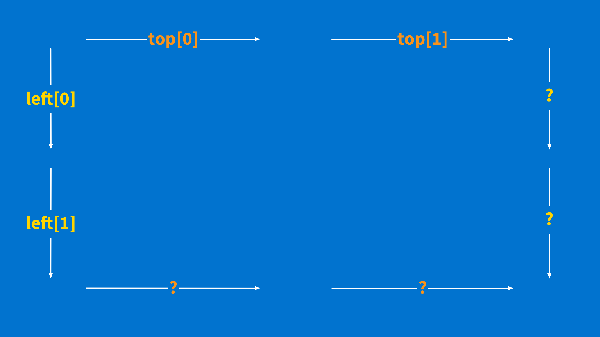

You have some arrows on the top and some arrows on the left, and you want to complete the square with the arrows on the right and an arrow on the bottom. You can use the same transformation functions you already wrote.  
你在上面有一些箭头，在左边有一些箭头，并且你想用右侧和底部的箭头完成一个矩形。你可以使用一些已写好的转换函数。

But there is a trick here. Because this is not one square. As you can see below, it is actually four.  
但是这里有一个窍门。因为这不是一个矩形，如下所示，它实际上是四个。

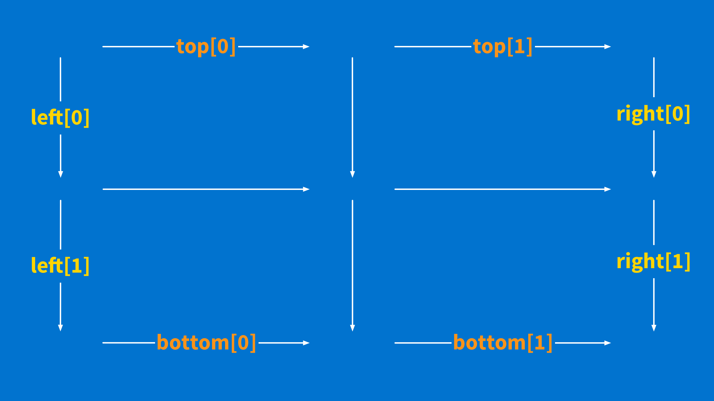

This is really important because the right side of one square becomes the new left side of the next square.  
这是非常重要的，因为一个矩形的右边是它右侧新生成矩形的左边。

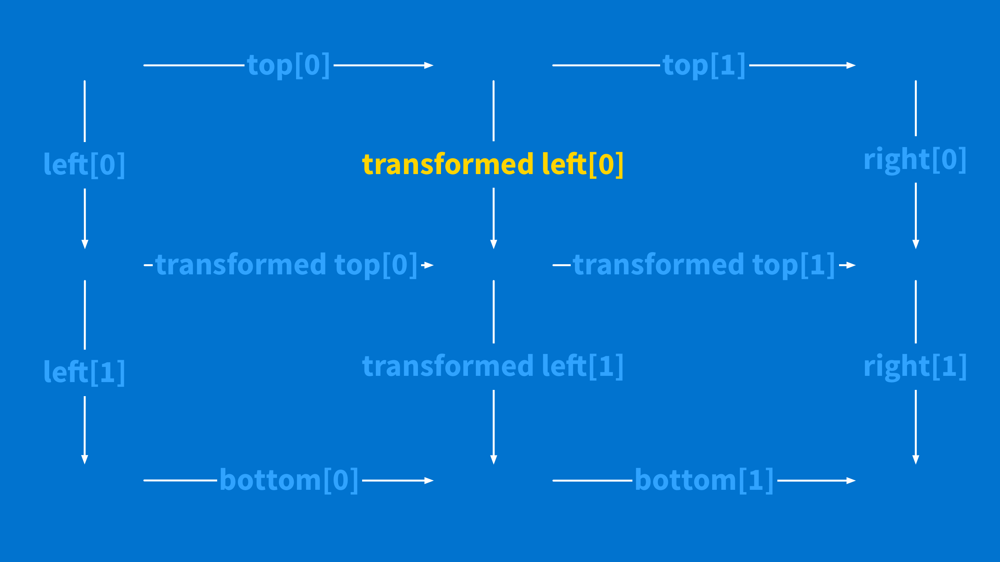

This is a little brain-bending. So, do not worry if it does not really sink in at first. It took years for people to find and fix this problem.  
这有点令人费解。但是如果你最开始没有理解它，也不需要担心。人们花费数年才发现并解决这个问题。

Just remember that you have to fill in every one of those squares. You can only have one operation per side of a square. And for every square, traveling across the top then right side has to result in the same value as traveling down the left then bottom side.  
请记住，您必须填写每个矩形。每个矩形的一侧只能进行一个操作。并且，每个矩形的`top`和`right`操作结果必须与`left`和`bottom`的结果相同。

So your transformation algorithm is a little bit like this:  
所以您的转换算法有点像这样：

* Take two lists of operations: the top list and the left list.
* 取两个操作列表：`top`列表和`left`列表
* Create two empty lists: the right list and the bottom list.
* 创建两个空列表：`right`列表和`bottom`列表
* Transform the first top operation and first left operation to get the bottom and right values.
* 转换第一个`top`操作和`left`操作生成`bottom`操作和`right`操作
* Push the bottom value onto the bottom list.
* 将`bottom`操作推入（PUSH）进`bottom`列表
* Hold on to the right value (I call it “transformed left”) because you will use it next.
* 保留`right`操作（我称它为“left转换”），因为你将要用到它

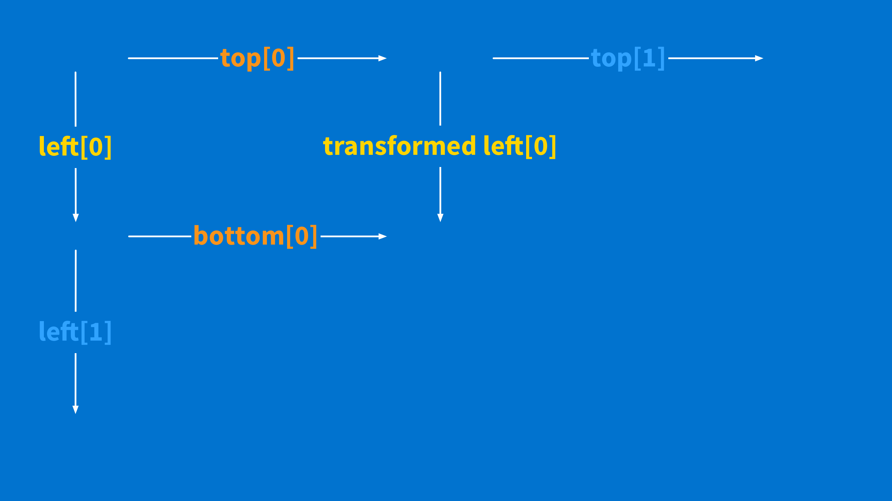

* Then, transform the next top operation and the “transformed left” operation. (That one you were holding on to.)
* 然后，转化下一个`top`操作和“left转换”操作。（继续保留）
* Take the bottom operation you get back, and push it onto the bottom list.
* 拿到`bottom`操作，并推入到`bottom`列表
* If you have any more top elements, you just keep turning the right one into the new left one and keep going.
* 如果你还有更多的`top`操作，你只需继续执行`top`操作和“left转换”操作的转换
* Once you reach the end of a row, push the last right value onto your right list.
* 一旦达到该行的最后面，将`right`操作推入`right`列表中。

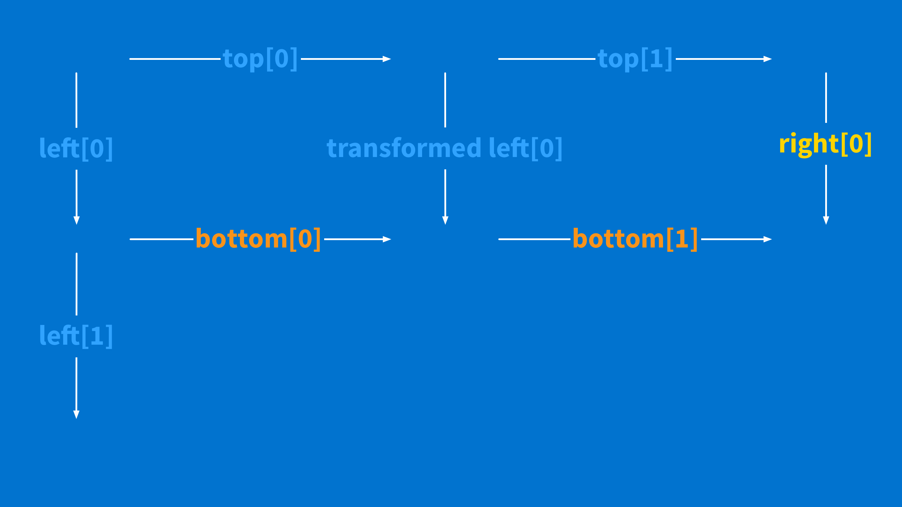

Now you have one element in your right list and a full row of bottom operations. Turn your bottom list into the new top list and repeat this whole process with the second element of the left list. Eventually, you get all the way to the bottom and complete both your lists.  
现在`right`列表有了一个操作，并且也有了一整行的`bottom`操作。现在将`bottom`列表转换为新的`top列表`，结合着`left`列表中的第二个元素，重复刚才的过程。最后执行完你就获得了完整的`bottom`和`right`列表。

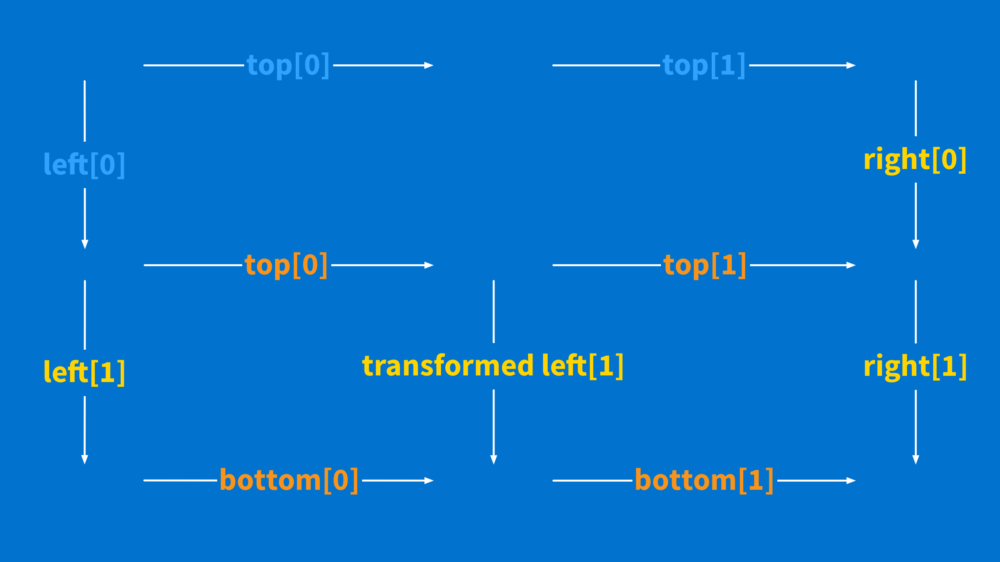

It might help to see this in code:  
看代码可能会对你有所帮助：

```javascript
function toArray(value) {
  if (!value) return [];
  if (Array.isArray(value)) return value;
  return [value];
}

function transform(left, top) {
  const leftList = toArray(left);
  let topList = toArray(top);

  if (leftList.length === 0 || topList.length === 0) {
    return [leftList, topList];
  }
  if (leftList.length === 1 && topList.length === 1){
    const rightOp = transformOperation(leftList[0], toplist[0], true);
    const bottomOp = transformOperation(topList[0], leftList[0], false);

    return [[rightOp], [bottomOp]];
  }
  const rightList = [];
  const bottomList = [];

  leftList.forEach((leftOp) => {
    const bottomList = [];
    let transformedLeftOp = leftOp;

    topList.forEach((topOp) => {
      const [rightOps, bottomOps] = transform(transformedLeftOp, topOp);

      transformedLeftOp = rightOps;
      bottom.concat(bottomOps);
    });
    rightList.concat(transformedLeftOp);
    topList = bottomList;
  });

  return [rightList, bottomList];
}
```

The first thing to do is to make sure we are only dealing with arrays to make the code simpler later on. This way, for the rest of our control algorithm, we are only thinking about transforming lists of operations.  
首先为了让之后的代码更简单先确保我们只处理数据。这样，对于控制算法的其余部分，我们就只考虑对操作列表的转换。

Next, we handle some simple cases. If either our left list or top list is empty, that means we do not have to do anything. From a user’s perspective, it would be when you were the only one who made changes or you walked away from your desk while someone else was making changes. There is nothing to transform.  
接下来，我们处理一些简单的场景。如果我们的`leftList`或者`topList`其中一个是空的，那么意味着，我们不需做任何转换。从用户的角度，它应该是只有你进行了修改或者其他进行了修改而你没进行修改。这样就没有什么需要转换。

If you are only transforming one operation against another operation, this is exactly the same transform method as the simple squares you saw earlier. You transform the left operation against the top operation to get the right operation, and then you do it in reverse to get the bottom operation.  
如果你仅对一个操作与另一个操作进行转换，那么这恰好与你之前看到的简单矩形转换的方法相同。你对`left`操作与`top`操作转换获得到`right`操作，再反向获得到`bottom`操作。

Now for the tricky part — when we have multiple operations in a row. Lines 13 and 14 create some empty arrays to hang onto our transformed operations as we get them. For the first row, we go through each operation on the top.  
第三个部分 - 当我们在一行中有多个操作时。第13、14行创建了一些空数组用来保存我们转换过的操作。对于第一行，我们遍历`topList`获取操作。

We transform them by calling this `transform` function recursively — usually, this will hit one of those two easy cases, so it is not worth thinking about too hard. It returns new transformed operations, which we will hold on to.  
我们递归调用`transform`方法转换它们 - 通常，这将触发上面两个简单场景中的其中一个，所以不需要过分考虑。它返回新的转换操作。我们将继续保留。

We get back a right operation. And remember, we use that operation as the new left operation the next time around. So let’s set the right operation to the left operation. Next, we take the bottom operation we got back, and add it to the bottom list.  
我们获得到一个`rightOp`操作。记住，下次我们将该操作用作新的`leftOp`操作。所以让我们将`rightOps`操作保存到`transformedLeftOp`。接下来我们将拿到的`bottomOps`添加到`bottomList`列表中。

Once we are done with a whole row, the last operation is the one we end up with, so we add it to our right list. This uses left_op, but at this point, left_op and right_op are equal.  
一旦该行完成，最后一个`rightOp`操作就是最后一个。所以我们把它添加到`rightList`列表中。这里我们使用的是`transformedLeftOp`，因为`transformedLeftOp`和`rightOp`是相同的。

And then, for the next time through the loop, our bottom list of operations becomes the new top list, and we keep going through. This is just like the second iteration we saw before.  
然后，在下一个循环中，我们的`bottomList`将成为新的`topList`，然后我们继续进行下去。就像我们之前看到的第二次迭代一样。

And, when this is done, we return the right and bottom lists back to the user. Piece of cake, right?  
并且，在完成操作后，我们将`rightLit`和`bottomList`返回给用户，很简单对吧？

Now, one upside — you probably will not have to ever write that yourself. And that is because control algorithms are generic. You could use that same function for all kinds of different apps and never have to change it. Your control algorithm doesn’t care at all about what your operations actually do.  
现在，一个好处 - 你大概不需要自己去写这个。并且因为控制算法是通用的。你可以不需要修改就将它们使用在别的应用上。控制算法并不关心你实际做什么。

What should your operations actually do? Whatever your application wants! 
您的操作实际上应该做什么？取决于你要干什么！

As long as you can write transformation functions that do not violate the transformation properties, you can invent new operations all day. This is great because you can get closer and closer to representing what a person is actually doing.  
只要您可以编写不违反转换属性的转换函数，就可以整天发明新的操作。这很棒，因为你可以越来越接近地代表一个人的实际行为。

But like everything, there is a tradeoff. The richer operations you have, the more operations you tend to have. And the more operations you have, the more transformation functions you have to write and the harder it is to get them right.  
但是，与所有事物一样，这是一个折衷方案。你拥有的操作越丰富，就趋向有更多的操作。并且，进行的操作越多，必须编写的转换函数就越多，正确执行转换的难度就越大。

When I worked on this problem, I had 13 different operations and I ended up writing over a hundred transformation functions. But having more specific operations meant I could keep some really strong user intent when two people were editing the same part of the document.  
解决此问题时，我有了13种不同的操作，最终编写了一百多个转换函数。但是，拥有更多特定的操作意味着当两个人在编辑文档的同一部分时，我可以真正保持用户的意图。

How can you make collaboration easier?  
如何使协作更轻松？

There are some things you can do to make writing a collaborative editor easy and other things that can make it nearly impossible.  
您可以做一些事情来简化编写协作编辑器的工作，而另一些事情可以是它变得几乎不可能实现。

1. Think in operations, not state changes: If you are planning to transform operations, you have to speak in terms of operations — the actions a person can take. If you are only storing full document states, you might have a tough road ahead of you.  
思考操作而不是状态改变：如果你打算转换操作，你必须用操作去表达 - 可以拿一个人的行为。如果你仅保存了文档的状态，你可能会遇到很多问题。  
There are ways around this. You can sometimes look at diffs of your document and infer operations from them. But you lose a lot of user intent that way. Think “insert t at position 1” not “The document changed from a to at.”  
有一些解决方法。有时您可以根据文档的差异并从中推断出操作。但是这样会失去很多用户意图。想象“在位置1插入‘t’”而不是“将文档从‘a’修改为‘at’”

2. Keep things linear: It is much easier if you can treat your document as an array of things — characters, rich objects, whatever. To transform array indexes is just addition and subtraction. You can sometimes represent trees linearly, too. Just have items in your array that mean “enter subtree” or “exit subtree.” In this case it is still easy to transform, but a little harder to work with.  
保持线性：如果你将文档当成一些字符、对象等等的数组，那么会容易的很多。转换数组只需要添加和删除。您有时也可以线性表示树。只要在数组中包含表示“进入子树”或“退出子树”的项即可。在这种情况下，转换仍然很容易，但是使用起来却有些困难。  
An array of characters is easier to transform than hierarchical data, but it’s not the worst thing if you have to transform trees. Instead of using indexes, you can use arrays of indexes. For example, this node could be reached by the path [1, 1] “child 1 of child 1.”  
字符数组比对象更容易转换，但如果您必须转换树这还不是最坏的。你可以使用索引数组而不是对象属性。例如，可以通过路径[1, 1]到达“child 1 of child 1.”这个节点。  
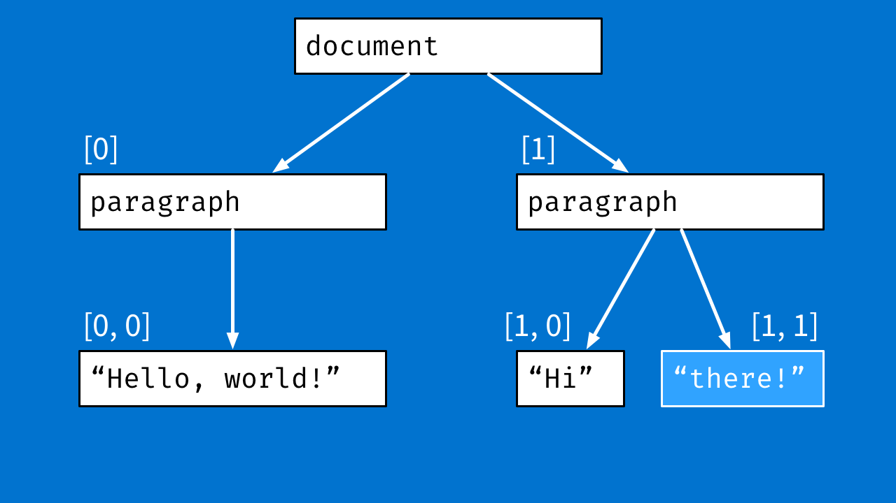

3. Make your data as transformable as possible: Strings can be transformed pretty easily. You can figure out something to do with numbers, like add them. If you have conflicting edits to a custom object, though, your decisions are a lot harder.  
使你的数据尽可能地可转换：字符串可以很容易地转换。你可以找出与数字有关的内容，例如将它们相加。如果您对自定义对象的编辑有冲突，那么您的决定就困难得多。  

How does this fit together?  

We have document states. (Let’s call them an array of characters to keep things simple.) Documents also have a version. Each client, as well as the server, has a copy of the document at a certain point.  
我们有文档状态（为了简化操作，称它们为字符数组）。文档还有版本。每一个客户端以及服务器，在某一个时刻有一个文档副本。  

You apply an operation on your own document right away so you do not have to wait to see it. Then you send it to a server, which sends it to other clients.  
你可以立即查看应用在自己文档上的操作。然后发送操作到服务器，该服务器将其发送到其他客户端。

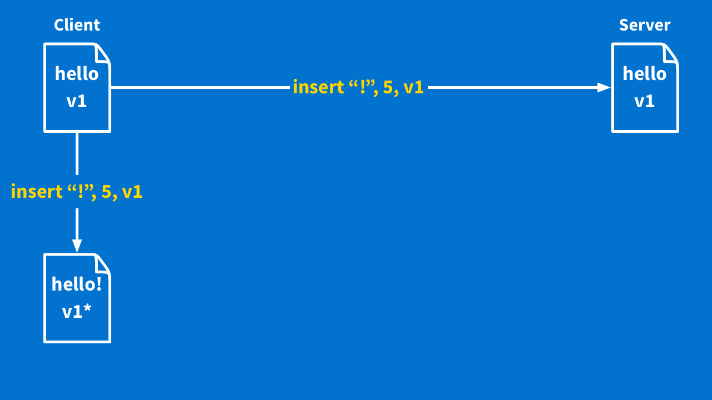

Sometimes, the server will say, “That is fine, I have not seen any new operations yet, my version is the same as yours.” It will acknowledge your version, you update your document version, and everyone is in sync.  
有些时候，服务器会说，“我没有任何新的操作，我与你的版本是相同的”它将确认你的文档版本，你更新文档版本，并且每个人都是同步的。 

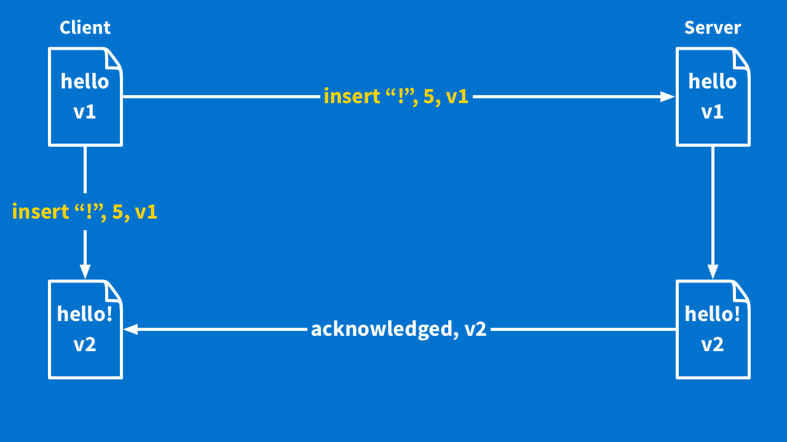

Other times, the server will say, “I cannot take that operation because I have seen a different document. But here are all the operations between your version and the one that I have.”  
其他时候，服务器会说，“我不能做这个操作，因为我看到一个不一样的文档。但是这是你版本与版本之间所有的操作”。

When that happens, you transform those operations against yours because yours has already happened from your perspective. Remember? You ran it right away. Then, you apply the operations from the server, which you transformed, to your document.  
当这时，你转换这些操作转换为你的操作，因为从你的角度来说，你的已经发生改变。还记得么？你马上就执行。然后，将转换后的服务器中的操作应用于文档。

Afterward, you transform your operation against all of the server’s operations because, from the server’s perspective, your operation happened after theirs. The server has not seen yours yet. Then you send that transformed version back to the server — hopefully, this time, the server will accept it. That process looks like the one shown below.  
之后，您将操作转换为服务器的所有操作。因为，从服务器的角度来说，你的操作发生在他们后面。而服务器还没有看过你的操作。将转换后的版本发送回服务器 - 希望这次服务器可以接受它。该过程如下所示。

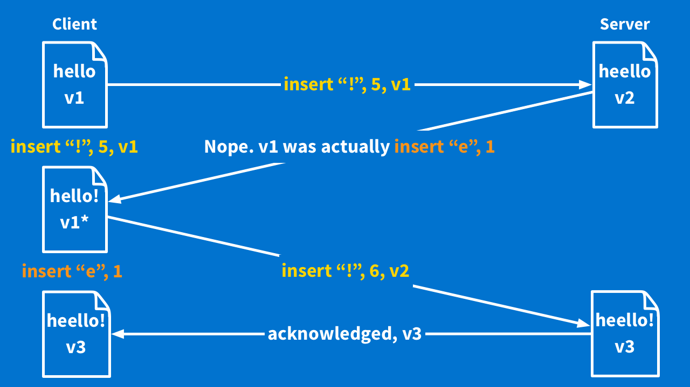

Now, everything is consistent. If there’s more than one operation happening at the same time, we have to do a little more work but the idea is still the same.  
现在，一切都保持一致。如果同时进行多个操作，我们还需要做更多的工作，但是想法还是一样。

What else do you need?  
你还需要什么？

When you transform operations, you can build a text editor that can handle multiple people editing at the same time. But that is not quite enough to really deliver a great experience. And I will show you two reasons why.  
当你转换操作，你可以构建一个文本编辑器，它可以处理多人同时编辑。但是不足以提供出色的体验。我将向您展示两个原因。

First, if you have a few people editing the same document, it can seem to the user as though letters and words just appear out of nowhere. The user has no idea where to expect changes or what is about to happen until it happens. It would be nice if the cursors of the other people editing the document were visible so that users have some idea what to expect.  
首先，如果你有几个人在编辑同一个文档，在用户看来，字母和单词似乎无处不在。用户在发生改变之前，不知道在哪里发生更改或将要发生的更改。如果其他人正在编辑该文档的光标是可见的，这样用户就可以知道会有什么期望。

Second, let’s say the user makes a mistake while typing and hits undo. There are two different changes the text editor could undo: Should it undo the last change you made? Or the last change anyone made?  
其次，假设用户在输入时输入错误并点击了“撤消”。文本编辑器可以撤消两种不同的更改：是应撤消您所做的最后更改？还是所有人做的最后更改？

Let’s call the scenario where you only undo your own changes “local undo.” And the second, where you can undo other people’s changes “global undo.”  
假设你只撤消自己的更改的情况称为“本地撤消”。你可以撤消其他人的更改称为“全局撤消”。

If you have tried text editors with each of these different styles of undo, it quickly becomes obvious that local undo is what feels normal. If you type a character, undo should remove that character, regardless of what anyone else typed afterward. To have a great collaborative editor, we need to add cursor reporting and local undo.  
如果您尝试过使用每种不同撤消操作的文本编辑器。很快就会发现，本地撤消是正常的。如果输入一个字符，则撤消操作应删除该字符，而不管其他人随后键入什么字符。要拥有出色的协作编辑器，我们就需要添加光标报告和本地撤消。  

Cursor synchronization  
光标同步

Let’s start with a bit of a philosophical question. What is a cursor, really? If your document is a list of things, a cursor is really just an position in that array.  
让我们从一个哲学问题开始。真正的光标是什么？如果您的文档是个数组，则光标实际上只是该数组中的一个位置。

In the document below, you have “Hello” and my cursor is before the “e.” You can say the cursor is at position 1. If it was after the “o,” you would say it is at position 5.  
在下面的文档中，文档中有“have”，并且你的光标在“e”前面，你可以说这个光标在位置1。如果它在“o”的后面，你应该说它在位置5。


What about other people’s cursors? They can also be numbers, but you probably also want to know whose cursor is whose. You can attach some kind of identifier. We will just use a number and call it a client ID. So, there are two numbers: a position and a client id.  
别人的光标呢？他们可以是数字，但是你可能还像知道这些是谁的光标。你可以附加某种标识符。我们将只使用一个数字并将其称为客户端ID。所以，它们是两个数字，一个位置，一个客户端ID。

Now our document is a little more complicated but not too bad. We have our list of things, a version, our own cursor offset, and a list of remote cursors. This is enough that you could render your text editor and those cursors however you want.  
现在我们的文档有些复杂，但还算不错。我们有一个数组，一个版本号，我们自己的光标位置，一个远程光标列表。这足以使你可以渲染文本编辑器和所需的光标。

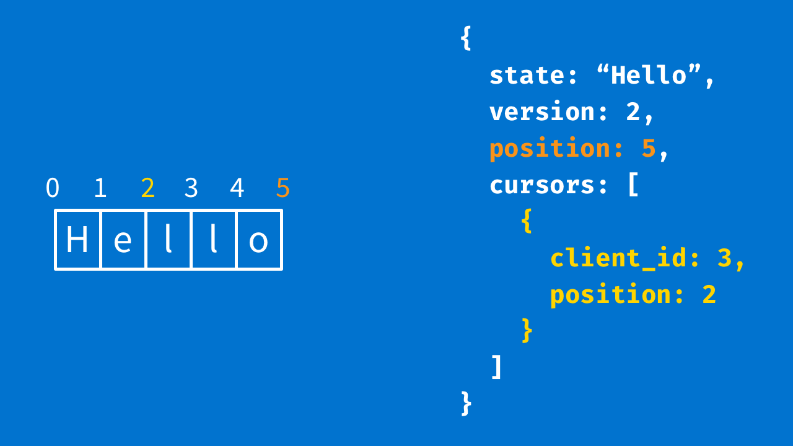

What would happen when you add a character or delete a character? Let’s go back to our first example, “cart.” Let’s say we are looking at our screen and client 2 left their cursor at position 2, in between “a” and “r.”  
添加字符或删除字符会发生什么？让我们回到第一个例子“cart”。比方说我们正在看屏幕中客户端2的光标留在“a”和“r"之间的位置2。


And then we run the operation, “insert h at position 1.” Now we have “chart.” Where should it draw the cursor for client 2? It would make the most sense to keep it where it was — between “a” and “r,” right?  
然后我们执行操作“在位置1插入‘h’”。现在我们获得“chart"。客户端2应该在哪里绘制光标？将其保留在“ a”和“ r”之间是最有意义的，对吗？  

So we can pretend that “place cursor at this position” is an operation, and we transform it against our “insert h at position 1” operation as shown below. We inserted a character before the cursor, so we move it over one spot.  
所以我们可以假装“将光标置于此位置”是一个操作，并将其转换为针对“在位置1插入h”的操作，如下所示。我们在光标之前插入了一个字符，因此将其移动到一个位置。

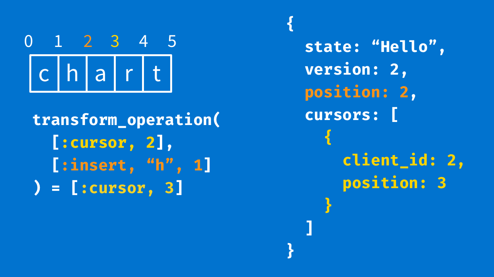

This is our rule: Any time you perform an operation, you need to transform all the cursors you know about against that operation to keep them in the right place. These transformations tend to be pretty easy — most are exactly the same as the insert_text transformations since you are just moving a position in both of them.  
这是我们的规则：每当你执行操作时，为了将光标保持在正确的位置，你需要针对该操作转换所有已知的光标。这些转换往往很容易 - 大多数都与insert_text转换完全相同，因为您只是在两个位置中都移动了一个位置。

Once you receive a cursor from another client, you need to know one other piece of information. What version of the document did that cursor come from?  
收到其他客户的游标后，您需要了解其他信息。该光标来自哪个版本的文档？

If the cursor is a position on a document version your client has not seen yet, your client cannot draw it — because you do not have that document. The cursor could be pointing to position 15, but your document only has 10 characters. So you can hold onto the cursor for later (if you want) or ignore it and hope the other client sends it again later.  
如果光标位于您的客户端尚未看到的文档版本上，你的客户端就无法绘制它 - 因为你没有这个文档。这个光标可能指向位置15，但是你的文档只有10个字符，所以你可以保留光标以备后用（如果需要），也可以忽略它，并希望其他客户端稍后再发送。

If the cursor placement is from an older version, it also might not apply to the current version of the document. When that happens, you could transform the cursor across all the operations between that version. For example, if your document is version 2 and you see a version 1 cursor, you could transform it against the operation that took your document from version 1 to version 2. Or you could also ignore it if you are expecting to see an updated cursor soon enough.  
如果光标位置来自旧版本，它也可能不适用于当前版本的文档。发生这种情况是，你可以通过之前所有的操作转换这个额光标。例如，如果你的文档版本是2，并且你看到了一个版本1的光标，可以针对版本1到2的操作转换它。或者你也可以忽略它，如果您希望尽快看到更新的光标。

If the cursor is on the same version, you might think this is the all-clear. And it is… but only if the server has acknowledged all of your operations. But if you are at version 15, and another client’s cursor is on version 15, but you have run an insert “h” operation that you have not sent to the server yet? Well, it looks like this.  
如果光标在同一版本上，您可能会认为这很清楚。确实如此……但前提是服务器已确认您的所有操作。但是，如果你使用的是版本15，而另一个客户端的光标在版本15上，但是你运行了尚未发送到服务器的插入“h”操作？看起来像这样。

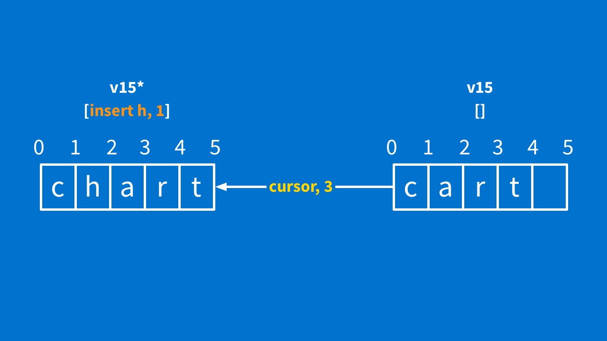

You have to transform the other client’s cursor against that operation. That client sent you a cursor at position 3 and you have to move it to position 4.  
你必须针对该操作转换另一个客户端的光标。该客户端向你发送了一个在位置3的光标，你必须将其移至位置4。

How about sending your cursor? You can send your cursor any time, as long as you have not made any changes that the server has not confirmed yet. Otherwise, your cursor might not make sense to clients and they will not know what to do. Once the server confirms your operations, you can start sending your cursor again.  
如何发送光标？你可以随时发送光标，只要你尚未进行任何服务器未确认的更改即可。否则，你的光标可能对其他客户端没有意义，并且它们将不知道该怎么办。服务器确认你的操作后，你可以再次开始发送光标。

Collaborative undo  
协同撤销

Just like with cursors, to figure out how to handle local undo, we have to understand how undo usually works. Remember, we are thinking in operations — “insert ‘a’ at position 3.”  
就像光标一样，弄清楚如何处理本地撤消，我们必须了解撤消通常如何工作。还记得，我们考虑的操作 - “在位置3插入‘a’”

How would you undo that? You would run the operation, “remove ‘a’ at position 3.”  
How would you redo? You would run the operation, “insert ‘a’ at position 3.”  
将如何撤消呢？你可以执行这个操作，“在位置3删除‘a’”  
将如何重做呢？你可以执行这个操作，“在位置3插入‘a’”

These two operations are inverses of each other — they cancel each other out. If you run an operation and then run its inverse, it is as though the original operation never happened. Which is exactly what you want with undo.  
这两个操作彼此相反 - 它们互相抵消了。如果你执行一个操作，然后执行逆向操作，它就好像从来没有发生过。这样的撤销正是你想要的。

Undo also works like a stack. The last thing you did is the first thing you undo.  
撤消也像栈一样工作。你做的最后一件事是你撤消的第一件事。

So, if our text editor was not collaborative, here is how you would apply an operation with undo:
因此，如果我们的文本编辑器不支持协作，则可以通过以下方法使用撤消操作：

* You perform an operation, like “insert h before position 1.”
* 你执行了一个操作，“在位置1之前插入‘h’”
* You invert that operation, so it becomes “remove h at position 1.”
* 你反转了这个操作，所以它变成了“在位置1删除‘h’”
* Then, you push that inverted operation onto the undo stack.
* 然后，你将反转的操作推入撤销栈中

What about when you hit undo?  
当你点击撤销该怎么样？

* You pop the operation (“remove h at position 1”) off the stack.
* 从堆栈弹出操作（“在位置1删除‘h’”）
* You apply it as if you were performing it to begin with.
* 你可以像执行它一样开始应用它。
* Then, if you want to support redo, you invert it again and push the inverse onto the redo stack.
* 然后，如果你想支持重做，你可以再次将其反转，然后将其反转推入重做堆栈。

Simple enough, right? Let’s see how that breaks when other people are collaborating with you. You run “insert s, 4” — that pushes “remove s, 4” onto the undo stack. And you send the insert to the server.  
很简单，对吧？让我们看看当其他人与你协作时，这种情况如何发生。

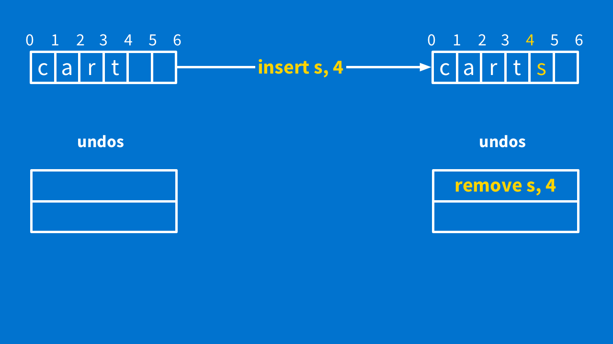

A little bit later, the server sends you the operation, “insert h at 1” — this is not happening simultaneously, so you do not have to transform it. Now our state is “charts.”  
稍后，服务器向你发送操作“在位置1插入‘h’” - 这不是同时发生的操作，因此你不必对其进行转换。现在我们的状态是“charts.”

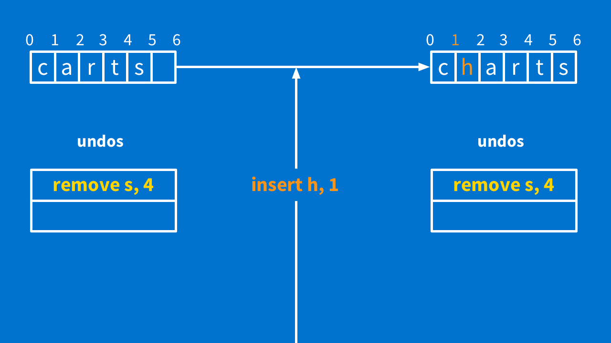

Now look at our undo stack. What would happen if you hit undo? You would run “remove s at 4” — but there is no “s” at position 4, right?  
现在看我们的撤销栈。如果您撤消操作会怎样？你将运行“在4处删除s”-但是在位置4处没有“s”，对吧？

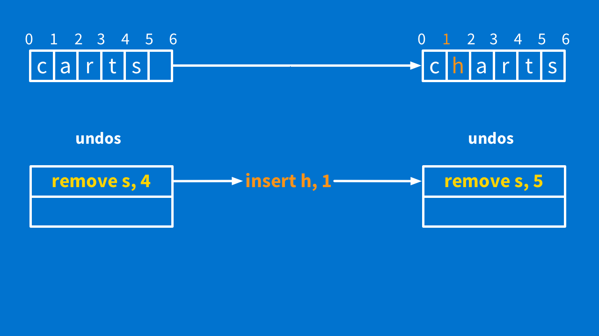

Clearly, we are missing a step. When you get the operation from the server, you need to transform all the operations in your undo stack against that operation. So, the undo stack is “remove s, 4.” We receive “insert h, 1″ and have to transform the undo stack so it looks like “remove s, 5.”  
显然，我们缺少一步。从服务器获取操作时，需要针对该操作转换撤消栈中的所有操作。所以，这个撤销栈是“在位置4移除‘s’”。我们接收到“在位置1插入‘h’”，并且必须转换撤消栈，使其看起来像“ 在位置5删除‘s’”。

Now, when we undo, we run “remove s at 5” it deletes the “s” at position 5 and everything is great.  
现在，当我们撤销，我们执行操作去删除位置5的‘s’，一切都很好。

When you receive an operation, you have to transform the undo stack against that operation. Luckily, we already have a function (that big transform one from earlier) that is really good at transforming lists of operations against other lists of operations.  
收到操作时，必须针对该操作转换撤消堆栈。幸运的是，我们已经有了一个函数（较早版本进行了大的转换），它确实擅长将操作列表与其他操作列表进行转换。

We can just use this:  
我们可以这样使用：

```ruby
def transform_stacks(remote_op)
  self.undos, _ = transform(self.undos, remote_op)
  self.redos, _ = transform(self.redos, remote_op)
end
```

```javascript
function transformStacks(remoteOp) {
  const [transformedUndos] = tranform(undos, remoteOp);
  const [transformedRedos] = tranform(redos, remoteOp);
}
```

Here is how collaborative local undo would work then:  
以下是协作式本地撤消将如何工作：

* When you perform an operation, invert it and push it on the stack.
* 执行操作时，请将其反转并将其推入堆栈。
* When you receive an operation, transform the stack against it.
* 当收到一个操作时，对撤销栈进行转换。
* When you undo, pop the top item off the stack and run it, sending it to the collaboration server.
* 撤消操作时，从栈中弹出第一个并运行它，然后将其发送到协作服务器。

This mostly works, but it is not perfect. In fact, it can violate some rules that you should have with undo. For example, if every client undoes a set of operations and then redoes them, the document should be in the same state as it was originally. Sometimes, with this method, it is not.  
这通常有效，但并不完美。事实上，它可能会违反一些撤消规则。例如，如果每个客户端撤消一组操作然后重做它们，该文档应与原始状态相同。有时，使用这种方法不是这样。

But this is a pragmatic balance between complexity and good-enough behavior. And I am not the only one who thinks so — almost all collaborative text editors that I have used, including Google Docs, can fail undo in the exact same ways.  
但这是复杂性和良好行为之间的务实平衡。我不是唯一这样认为的人 - 我使用过的几乎所有协作文本编辑器（包括Google Docs）都可能以完全相同的方式使撤消失败。

Putting it all together  
全部放在一起

The following is enough to make collaboration work with any kind of app. You start with a document, which can be as simple of an array of things, a version, a cursor, a list of remote cursors, and an undo stack. You have operations that act on that state, such as insert character and remove character. These operations know which version of the document they came from.  
以下内容足以使协作与任何类型的应用程序协同工作。从一个文档开始，该文档可以是一个简单的数组，一个版本，一个光标，一个远程光标的乐鸟，一个撤销栈。有针对如文档状态的操作，例如插入字符和删除自如。这些操作知道它们来自哪个版本的文档。

You have a set of transformation functions, which take two operations that happened at the same time and transform them so they can be run one after the other.  
你有一组转换函数，为了让它们一个接一个运行，你需要对两个同时的操作进行转换。

You have a control algorithm, which can take two lists of operations and transform each side against each other to come up with documents that end up in the same place. You have functions to transform cursors and functions to send and receive cursors, transforming them on the way in.  
你有一个控制算法，可以接受两个操作列表，并且相互转换得到最终一直的文档。你有一个函数对光标进行转换，并且在过程中接收、发送、转换它们。

And you have an undo stack and a redo stack, which hold inverted operations that get transformed whenever a remote operation comes in.  
而且你有一个撤消堆栈和一个重做堆栈，它们包含反向操作，只要有远程操作进来，它们就会转换。

When you perform an operation, you:
当你执行一个操作，你应该：

* Apply it to your document.
* 将它应用到文档中
* Transform all the cursors against it.
* 转换所有的光标
* Send it to the server.
* 将它发送到服务器
* Send your current selection once everything calms down.
* 当一切结束后，发送你的选区

When you receive an operation, you:
当你接受一个操作，你应该：

* Transform your pending operations against it to complete the transformation square.
* 转换你等待发送的操作，以完成转换平方
* Apply the transformed operation to your document, and send your pending transformed operations to the server.
* 将转换后的操作应用到文档，并且发送你转换后等待发送的操作到服务器
* Transform all the cursors you know about against the operation you received and transformed.
* 根据接收和转换的操作来转换所有的光标
* Transform your undo stack against it as well.
* 也可以根据它转换撤消栈

When you change your cursor position and you have no pending operations:
当你改变了光标的位置，但是你没有任何修改:

* Send your current cursor position.
* 发送你当前光标的位置

When you get a cursor from someone else:
当您从其他人那里获得光标时：

* If the cursor is for an older version of the document, either ignore it, or transform it up to your current version.
* 如果这个光标来自一个老的版本，可以忽略它，或者根据新版本转换它。
* If it is for the current version of the document, transform it against any pending operations.
* 如果这个光标是来自当前版本，使用所有等待发送的操作对它进行转换
* If it is for a future version of the document, either ignore it or hold onto it until you see that version of the document.
* 如果这个光标来自未来的版本。可以忽略它，或者保留它到可以看到这个版本的文档时

I have a demo that puts all this together, which you can play with.
我有一个演示，将所有这些放在一起，您可以玩。

Where to go next
接下来呢？

There are a lot of ways to build collaborative applications, but this is a good one to start with. It works for all different kinds of apps, it is not too hard to build, and it is extremely flexible. It is a model you will see a lot of companies use.  
构建协作应用程序的方法有很多，但这是一个很好的开始。它适用于所有类型的应用程序，构建起来并不难，并且非常灵活。你可以看到许多公司使用的这种模式。

But it is not perfect because:  
但这并不完美，因为：

* This model needs a server to work.
* 这种模式需要服务器支持 
* There are some edge cases, especially around undo, that would add a lot of complexity if you want to fix them.
* 有一些极端的情况，尤其是在撤消操作领域，如果要修复它们，将会增加很多复杂性。
* Depending on what you are building, there are other collaboration methods that might be easier or more correct.
* 根据您要构建的内容，还有其他一些更简单或更正确的协作方法。

If you want to build peer-to-peer collaboration that does not rely on a central server, take a look into conflict-free replicated data types (CRDTs). Same thing if you are just dealing with plain text — CRDTs tend to be great at that. CRDTs are newer collaboration methods that fit some specific kinds of text editors really well and they are getting even better.  
如果要建立不依赖中央服务器的对等协作，可以查看无冲突的复制数据类型（CRDT）。如果您只处理纯文本，则这是同一件事-CRDT通常很擅长于此。CRDT是较新的协作方法，非常适合某些特定类型的文本编辑器，而且它们甚至越来越好。

If you are using operational transformation and you do not want to write the server or control algorithm yourself, take a look at ShareDB. If you want to check out CRDTs, Y.js, Gun, and Automerge are all really cool projects.  
如果您使用的是OT，并且不想自己编写服务器或控制算法，看一下ShareDB。如果你想使用CRDT，Y.js，Gun和Automerge都是非常不错的项目。
