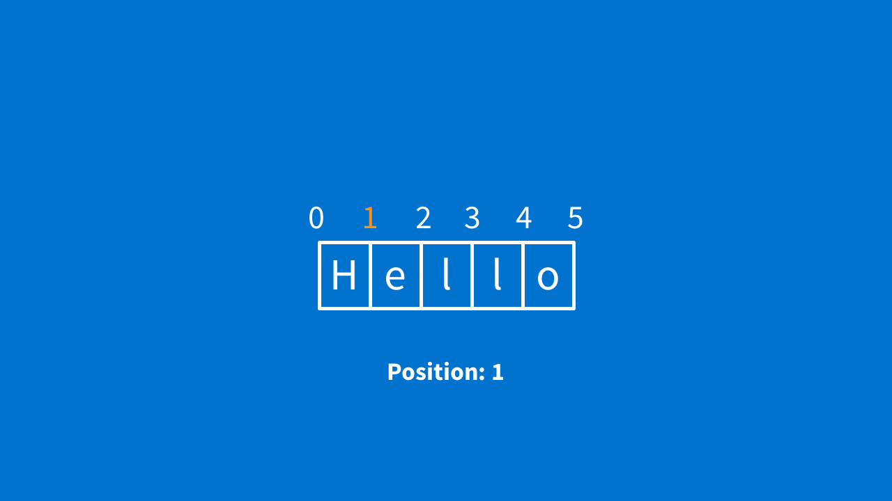
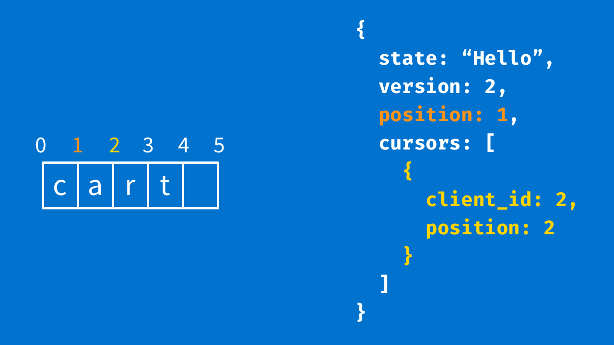

What does collaborative editing look like?
协同编辑是什么样的？

As developers, you will probably think of Git. You make changes to your document, someone else makes changes on their document, you merge, and then one of you fixes conflicts.
作为一个开发者，你可能会想到Git。你对你的文档进行修改，其他人对他们的文档进行修改，你合并，然后你们中的一个人解决冲突。

Part of that process is great. You can just make changes without having to wait for anyone else. That is called making changes optimistically, in the sense that you can do stuff without having to tell other people first and assume that your changes will come through.
这个过程中的一部分非常棒，你无需等待其他人就可以进行修改。这就是所谓的乐观地进行修改，在某种意义上，你假设你的修改会成功，而无需告诉其他人。

Part of that process is not great. When you and I are editing the same document at the same time, we do not want to be interrupted every few minutes to deal with conflicts. A text editor that worked like that would be unusable. But conflicts do not constantly happen. They only happen when we try to edit the same place at the same time, which is not common.
这个过程中的另一个部分不太好，当你和我同时编辑同一个文档时，我们不想每隔几分钟就被处理冲突所打扰。这种情况下编辑器将变的无法使用。但是冲突并不会经常发生，它仅会发生在同时编辑同一个位置，但是这并不常见。

When a conflict does happen, though, what if we were not bugged about it? The system could make its best guess on what to do, and one of us could fix it if it was wrong. In theory, this seems like a terrible idea that could never work. In practice, it mostly does work.
不过，当有冲突时，我们要是没能解决问题呢？系统最好可以猜测到该怎么做，如果它是错的，我们可以修复它。理论上，这看起来像一个永远行不通的糟糕想法。实际上，它完全行得通。

So how does this work in practice? The system doesn’t need to be right, it just has to be consistent, and it needs to try to keep your intent.
所以如何让它在实际中工作呢？系统不需要是正确的，它只需要一致，和尝试去保留你的意图。

The image below shows this. If I type in the word “hello,” the system should do its very best to make sure “hello” ends up in the document somewhere. That is intent.
下面这张图片显示了这一点，如果我输入“hello”，最终系统应该尽力保证“hello”在文档的某个位置，这是它的意图。


And if someone else types “bye” at the same spot at the same time? Our two documents should eventually end up exactly the same, whether that is “hellobye” or “byehello” — the documents need to be consistent.
如果同时另一个人在同一个位置输入“bye”？我们的两个文档最终应该完全相同，不管它是“hellobye”还是“byehello” - 文档需要一致

What about conflicts? Well, people are kind of natural conflict resolution machines. If you are walking down the hallway, and someone is about to walk into you, you will stop. Probably both of you will move to the same side. And then maybe you will both move to the other side and you will laugh. But then eventually one of you will move, and the other will stand still, and everything will work out.
冲突呢？好吧，人类是一个天然解决问题的机器。如果你在走走廊，某人即将走到你身边，你会停止。你俩可能会走向同一边，然后又同时走向另一边，然后一起笑。但是最后你们其中一个会移动弄，而另一个站着不动，问题迎刃而解。

So, you want your editor to quickly respond to the person using it. If you are typing, you do not want to wait for a network request before you can see what you typed. And you want the other people editing your document to see your changes. And you want to do all of this as fast as possible. How could you make that work?

The first thing you might think of is sending diffs, like the image below. “This person 1 changed line 5 from this to this.” But it is hard to see intent in a diff. All diffs do is tell you what changed, not why.


A better way is to think in terms of actions a person could take: “I inserted character ‘a’ at position 5.” “I deleted character ‘b’ after position 8.”


You can make these actions (or operations) pretty much whatever you want. Everything from “insert some text” to “make this section of text bold.” You can apply these to a document, and when you do, the document changes. So, as you can see below, applying this operation changes “Hello” to “Hello, world.”


If we have operations, and we can send operations, and we can change documents by applying operations, then we almost have collaboration.

What if client A sent an “insert ‘world’ at 5” operation to client B? Client B could apply that operation, and you would have the same doc! Bingo — job is finished and it is perfect. Except it is not.

Because remember — you could both be changing the document at the same time. So, let’s say you have two clients. They each have a document with the text “at” as shown below.


Now, the left client types “c” at position 0, making the word “cat.” At the same time, the other client types “r” at position 1, making the word “art.”


Now, the client on the right gets this “insert c at 0” operation from the other client and ends up with “cart.” So far, so good. But then the client on the left gets the “insert r at 1” operation from the other client, ending up with the “crat” you see below.


And I have no idea what a “crat” is. (Do you?)

Worse than the unknown “crat,” we have violated one of our most important rules. Both documents need to be consistent with one another — they need to end up at the same state. Because now, if the client on the left deletes the character “a” after position 2, it also deletes “r” on this other client without having any idea that it is doing it. It is wrong and broken in a way a person cannot fix.

So, something else needs to happen. And that something is operational transformation.

Transforming operations

So let’s look at the problem again. We have two operations that happen at the same time, meaning they both came from the same document state — the “at” example we talked about earlier.


Whenever we have two operations that happen on the same exact document, that means we might need to change one of them. This is because you can only make changes one after the other, in order — like we just saw with “cart” and “crat,” order matters. On this client, it means that the insert “r” has to change so that it can happen after the insert “c.” So what would this look like?

Well, after you insert “c,” the old position 1 (highlighted in yellow below) is now position 2. Everything moved over by one. If the “r” goes in between “a” and “t” (just like it did over on the other client), it should go into position 2 — right? So, when you get that “insert r at 1,” you transform it into “insert r at 2” before you apply it.


How about on the other side? It gets “insert c at 0.” But position 0 has not moved, so “insert c at 0” can just stay as it is.


What you are trying to do is say, “If operation A and operation B happened at the same time, how could I change operation B to adjust for what operation A did?”

That can sometimes be abstract and hard to think about. So I draw boxes instead. (Yep, I have lots of pieces of paper filled with boxes.) But check this out below. In the upper-left corner, I write a document state — “at.”


I draw an arrow going right and I write one of the operations (“insert c at 0”) on it. Then in the upper-right, I write what things look like after that happens (“cat”). Then I draw a line going down.


Next, I draw an arrow going down. This one gets the other operation (“insert r at 1”). Same as before: I write down what things look like after that happens (“art”). And I draw an arrow going right. We end up with what you see below.


Now we have a decision to make. In the lower right-hand corner, what should the document look like? This is where thinking about what your user would expect can help, but sometimes you have to just make a decision.

Here, though, the answer is not ambiguous — it should be “cart.” What would need to happen to turn “cat” into “cart”? “Insert r at 2.” What would need to happen to turn “art” into “cart”? “Insert c at 0.” So we will fill in the blank arrows. Those two arrows are our two transformed operations.


Once you know this, it is really easy to test drive the code that transforms your operations. The top and left sides are your inputs, and the right and bottom sides are your expected outputs.

There is one last problem to solve before we can start writing these, though. How do you break ties? If both clients are trying to insert the text in the exact same place, whose text ends up first?

Remember — you do not have to be right, you just have to be consistent. So, pick a consistent tiebreaker. If you are communicating with a server, you can decide that the server always wins. Or you can give every client a random ID, and the biggest one wins. Just be consistent.

Writing a transformation function

We have some operations to transform and some expected return values. What would this transformation function actually look like?

We will start with this:

```
def transform(top, left, win_tiebreakers = false)
  bottom = transform_operation(top, left, win_tiebreakers),
  right =  transform_operation(left, top, !win_tiebreakers)
  [bottom, right]
end
```

It transforms top against left to get the bottom arrow, then left against top to get the right arrow, and then returns both of them, which completes our square. But that is just punting the question. What does a transform_operation function look like?

Let’s focus on the line that starts with `right =`. How do you transform that left operation so it acts as if it happened after the top operation shifts everything over and becomes that right arrow — “insert r at 1”?

```
# ours:   { type: :insert, text: “r”, position: 1 }
# theirs: { type: :insert, text: “c”, position: 0 }
def transform_operation(ours, theirs, win_tiebreakers)
  # TODO: handle other kinds of operations

  transformed_op = ours.dup

  if ours[:position] → theirs[:position] || 
    (ours[:position] == theirs[:position] && !win_tiebreakers )
    transformed_op[:position] = 
      transformed_op[:position] + theirs[:text].length
  end

  transformed_op
end
```

If we are only thinking about inserting text for now, writing transform_component is not too hard. We write a to-do for later.

Next, we return a new operation because we do not want to mess anything up by changing the one that was passed to us. In the `if` line, we answer the question: What would cause our position to change?

If the other client is inserting text before our spot, we will need to move over. And if they are inserting text at the same spot as us, and we lose the tiebreaker, we will also have to move over. If either of those scenarios happens, we need to move our position over by the length of the text they are inserting. If they are typing one character, we move over by one. Just like we saw before — because somebody typed a “c” before our “r,” we need to move over or we get “crat.”

This is about as simple as transformation functions get, but most of them follow the same sort of pattern:

* Check whether the other operation can affect us somehow.
* If it can, return a new operation with that effect taken into account.
* Otherwise, return the original operation.

Transformations can get complicated. But they are very functional, in the mathematical sense, which makes them easy to test. And there are some mathematical properties that these functions have to fulfill.

For example, there is a property called TP1 that says:

* If you have two documents with the same state…
* And you apply the first operation followed by the transformed second operation…
* You will end up with the same document as if you applied the second operation followed by the transformed first operation.

That is kind of a mouthful. But to visualize what it really says, take a look at this square below, starting in the upper left-hand corner. From there, if you take the top arrow and then the right arrow, you will end up with the same document as if you took the left arrow and then the bottom arrow.


If you are transforming things correctly, no matter which path you take, you end up at the same destination. Math makes it even easier to test your transformation functions. You can generate a whole bunch of random operations, transform them against each other, apply them to a document, and — as long as the documents end up equal at the end — you know that those transformation functions work.

So even though transformation functions can get complicated, it is not too hard to make sure they work.

Now, these square diagrams only really work if there are two clients sending operations at the same time — right? You can only really have two arrows going out of that top-left corner and reaching the bottom left corner. If you have three clients, you get three-dimensional diagrams, if you have four, you get four-dimensional diagrams, and so on. And every path through those diagrams has to end up at the same state.

But if you have a single source of truth, a central server, this all becomes so much easier. Instead of a three-dimensional diagram, you have a few two-dimensional ones — one for each client-server connection. The clients do not talk to each other directly. They talk through the server. (And as Rails devs, most of us are fairly used to relying on back-end servers.) So from now on, let’s assume we have a server and our operations go through it.

When do you need to transform operations?

We just talked about transformation functions. These functions transform operations so you end up with sequences of operations that will all end up at the same document. But there is another piece of information you still need.

We still need to know which operations to transform. For that, we have a control algorithm. And in order to figure that out, the algorithm needs to know if two documents are the same, so we can tell if two operations happened at the same time.

Since we are talking to a server, this is easy — the server is your source of truth. It can give every document a unique version number and use that number to tell whether two documents are the same.

Once we have a document version, we can keep track of which document version each operation happened in. So we add the version number of the document to every operation we create, like this:

```
→ operation
{
  type: :insert,
  text: “r”,
  position: 1,
  version: 2
}
```

Let’s say our “at” example was version 2. We had two clients run operations on that same document (“insert C” and “insert r”), so they also get version 2.

This way, you can tell that these operations happened at the same time and you know you need to transform them. After applying each operation, we end up with a new document version.

But what would happen if you went a little further before syncing up? What if two clients each ran two operations before they talked to each other, instead of just one?

Transforming multiple operations

Just like our example earlier, it is easier to visualize if you draw a square so you can see what is happening.


You have some arrows on the top and some arrows on the left, and you want to complete the square with the arrows on the right and an arrow on the bottom. You can use the same transformation functions you already wrote.

But there is a trick here. Because this is not one square. As you can see below, it is actually four.


This is really important because the right side of one square becomes the new left side of the next square.


This is a little brain-bending. So, do not worry if it does not really sink in at first. It took years for people to find and fix this problem.

Just remember that you have to fill in every one of those squares. You can only have one operation per side of a square. And for every square, traveling across the top then right side has to result in the same value as traveling down the left then bottom side.

So your transformation algorithm is a little bit like this:

* Take two lists of operations: the top list and the left list.
* Create two empty lists: the right list and the bottom list.
* Transform the first top operation and first left operation to get the bottom and right values.
* Push the bottom value onto the bottom list.
* Hold on to the right value (I call it “transformed left”) because you will use it next.


* Then, transform the next top operation and the “transformed left” operation. (That one you were holding on to.)
* Take the bottom operation you get back, and push it onto the bottom list.
* If you have any more top elements, you just keep turning the right one into the new left one and keep going.
* Once you reach the end of a row, push the last right value onto your right list.


Now you have one element in your right list and a full row of bottom operations. Turn your bottom list into the new top list and repeat this whole process with the second element of the left list. Eventually, you get all the way to the bottom and complete both your lists.


It might help to see this in code:

```
def transform(left, top)
  left = Array(left)
  top = Array(top)
  
  return [left, top] if left.empty? || top.empty?

  if left.length == 1 && top.length == 1
    right = transform_operation(left.first, top.first, true)
    bottom = transform_operation(top.first, left.first, false)
    return [Array(right), Array(bottom)]
  end

  right = []
  bottom = []

  left.each do |left_op|
    bottom = []
    
    top.each do |top_op|
      right_op, bottom_op = transform(left_op, top_op)
      left_op = right_op
      bottom.concat(bottom_op)
    end
    
    right.concat(left_op)
    top = bottom
  end

  [right, bottom]
end
```

The first thing to do is to make sure we are only dealing with arrays to make the code simpler later on. This way, for the rest of our control algorithm, we are only thinking about transforming lists of operations.

Next, we handle some simple cases. If either our left list or top list is empty, that means we do not have to do anything. From a user’s perspective, it would be when you were the only one who made changes or you walked away from your desk while someone else was making changes. There is nothing to transform.

If you are only transforming one operation against another operation, this is exactly the same transform method as the simple squares you saw earlier. You transform the left operation against the top operation to get the right operation, and then you do it in reverse to get the bottom operation.

Now for the tricky part — when we have multiple operations in a row. Lines 13 and 14 create some empty arrays to hang onto our transformed operations as we get them. For the first row, we go through each operation on the top.

We transform them by calling this `transform` function recursively — usually, this will hit one of those two easy cases, so it is not worth thinking about too hard. It returns new transformed operations, which we will hold on to.

We get back a right operation. And remember, we use that operation as the new left operation the next time around. So let’s set the right operation to the left operation. Next, we take the bottom operation we got back, and add it to the bottom list.

Once we are done with a whole row, the last operation is the one we end up with, so we add it to our right list. This uses left_op, but at this point, left_op and right_op are equal.

And then, for the next time through the loop, our bottom list of operations becomes the new top list, and we keep going through. This is just like the second iteration we saw before.

And, when this is done, we return the right and bottom lists back to the user. Piece of cake, right?

Now, one upside — you probably will not have to ever write that yourself. And that is because control algorithms are generic. You could use that same function for all kinds of different apps and never have to change it. Your control algorithm doesn’t care at all about what your operations actually do.

What should your operations actually do? Whatever your application wants!

As long as you can write transformation functions that do not violate the transformation properties, you can invent new operations all day. This is great because you can get closer and closer to representing what a person is actually doing.

But like everything, there is a tradeoff. The richer operations you have, the more operations you tend to have. And the more operations you have, the more transformation functions you have to write and the harder it is to get them right.

When I worked on this problem, I had 13 different operations and I ended up writing over a hundred transformation functions. But having more specific operations meant I could keep some really strong user intent when two people were editing the same part of the document.

When I worked on this problem, I had 13 different operations and I ended up writing over a hundred transformation functions. But having more specific operations meant I could keep some really strong user intent when two people were editing the same part of the document.

How can you make collaboration easier? 

There are some things you can do to make writing a collaborative editor easy and other things that can make it nearly impossible.

1. There are some things you can do to make writing a collaborative editor easy and other things that can make it nearly impossible.
There are ways around this. You can sometimes look at diffs of your document and infer operations from them. But you lose a lot of user intent that way. Think “insert t at position 1” not “The document changed from a to at.”

2. Keep things linear: It is much easier if you can treat your document as an array of things — characters, rich objects, whatever. To transform array indexes is just addition and subtraction. You can sometimes represent trees linearly, too. Just have items in your array that mean “enter subtree” or “exit subtree.” In this case it is still easy to transform, but a little harder to work with.
An array of characters is easier to transform than hierarchical data, but it’s not the worst thing if you have to transform trees. Instead of using indexes, you can use arrays of indexes. For example, this node could be reached by the path [1, 1] “child 1 of child 1.”


3. Make your data as transformable as possible: Strings can be transformed pretty easily. You can figure out something to do with numbers, like add them. If you have conflicting edits to a custom object, though, your decisions are a lot harder.

How does this fit together?

We have document states. (Let’s call them an array of characters to keep things simple.) Documents also have a version. Each client, as well as the server, has a copy of the document at a certain point.

You apply an operation on your own document right away so you do not have to wait to see it. Then you send it to a server, which sends it to other clients.


Sometimes, the server will say, “That is fine, I have not seen any new operations yet, my version is the same as yours.” It will acknowledge your version, you update your document version, and everyone is in sync.


Other times, the server will say, “I cannot take that operation because I have seen a different document. But here are all the operations between your version and the one that I have.”

When that happens, you transform those operations against yours because yours has already happened from your perspective. Remember? You ran it right away. Then, you apply the operations from the server, which you transformed, to your document.

Afterward, you transform your operation against all of the server’s operations because, from the server’s perspective, your operation happened after theirs. The server has not seen yours yet. Then you send that transformed version back to the server — hopefully, this time, the server will accept it. That process looks like the one shown below.


Now, everything is consistent. If there’s more than one operation happening at the same time, we have to do a little more work but the idea is still the same.

What else do you need?

When you transform operations, you can build a text editor that can handle multiple people editing at the same time. But that is not quite enough to really deliver a great experience. And I will show you two reasons why.

First, if you have a few people editing the same document, it can seem to the user as though letters and words just appear out of nowhere. The user has no idea where to expect changes or what is about to happen until it happens. It would be nice if the cursors of the other people editing the document were visible so that users have some idea what to expect.

Second, let’s say the user makes a mistake while typing and hits undo. There are two different changes the text editor could undo: Should it undo the last change you made? Or the last change anyone made?

Let’s call the scenario where you only undo your own changes “local undo.” And the second, where you can undo other people’s changes “global undo.”

If you have tried text editors with each of these different styles of undo, it quickly becomes obvious that local undo is what feels normal. If you type a character, undo should remove that character, regardless of what anyone else typed afterward. To have a great collaborative editor, we need to add cursor reporting and local undo.

Cursor synchronization

Let’s start with a bit of a philosophical question. What is a cursor, really? If your document is a list of things, a cursor is really just an position in that array.

In the document below, you have “Hello” and my cursor is before the “e.” You can say the cursor is at position 1. If it was after the “o,” you would say it is at position 5.



What about other people’s cursors? They can also be numbers, but you probably also want to know whose cursor is whose. You can attach some kind of identifier. We will just use a number and call it a client ID. So, there are two numbers: a position and a client id.

Now our document is a little more complicated but not too bad. We have our list of things, a version, our own cursor offset, and a list of remote cursors. This is enough that you could render your text editor and those cursors however you want.


What would happen when you add a character or delete a character? Let’s go back to our first example, “cart.” Let’s say we are looking at our screen and client 2 left their cursor at position 2, in between “a” and “r.”



And then we run the operation, “insert h at position 1.” Now we have “chart.” Where should it draw the cursor for client 2? It would make the most sense to keep it where it was — between “a” and “r,” right?

So we can pretend that “place cursor at this position” is an operation, and we transform it against our “insert h at position 1” operation as shown below. We inserted a character before the cursor, so we move it over one spot.


This is our rule: Any time you perform an operation, you need to transform all the cursors you know about against that operation to keep them in the right place. These transformations tend to be pretty easy — most are exactly the same as the insert_text transformations since you are just moving a position in both of them.

Once you receive a cursor from another client, you need to know one other piece of information. What version of the document did that cursor come from?

If the cursor is a position on a document version your client has not seen yet, your client cannot draw it — because you do not have that document. The cursor could be pointing to position 15, but your document only has 10 characters. So you can hold onto the cursor for later (if you want) or ignore it and hope the other client sends it again later.

If the cursor placement is from an older version, it also might not apply to the current version of the document. When that happens, you could transform the cursor across all the operations between that version. For example, if your document is version 2 and you see a version 1 cursor, you could transform it against the operation that took your document from version 1 to version 2. Or you could also ignore it if you are expecting to see an updated cursor soon enough.

If the cursor is on the same version, you might think this is the all-clear. And it is… but only if the server has acknowledged all of your operations. But if you are at version 15, and another client’s cursor is on version 15, but you have run an insert “h” operation that you have not sent to the server yet? Well, it looks like this.


You have to transform the other client’s cursor against that operation. That client sent you a cursor at position 3 and you have to move it to position 4.

How about sending your cursor? You can send your cursor any time, as long as you have not made any changes that the server has not confirmed yet. Otherwise, your cursor might not make sense to clients and they will not know what to do. Once the server confirms your operations, you can start sending your cursor again.

Collaborative undo

Just like with cursors, to figure out how to handle local undo, we have to understand how undo usually works. Remember, we are thinking in operations — “insert ‘a’ at position 3.”

How would you undo that? You would run the operation, “remove ‘a’ at position 3.” How would you redo? You would run the operation, “insert ‘a’ at position 3.”

These two operations are inverses of each other — they cancel each other out. If you run an operation and then run its inverse, it is as though the original operation never happened. Which is exactly what you want with undo.

Undo also works like a stack. The last thing you did is the first thing you undo.

So, if our text editor was not collaborative, here is how you would apply an operation with undo:

* You perform an operation, like “insert h before position 1.”
* You invert that operation, so it becomes “remove h at position 1.”
* Then, you push that inverted operation onto the undo stack.

What about when you hit undo?

* You pop the operation (“remove h at position 1”) off the stack.
* You apply it as if you were performing it to begin with.
* Then, if you want to support redo, you invert it again and push the inverse onto the redo stack.

Simple enough, right? Let’s see how that breaks when other people are collaborating with you. You run “insert s, 4” — that pushes “remove s, 4” onto the undo stack. And you send the insert to the server.


A little bit later, the server sends you the operation, “insert h at 1” — this is not happening simultaneously, so you do not have to transform it. Now our state is “charts.”


Now look at our undo stack. What would happen if you hit undo? You would run “remove s at 4” — but there is no “s” at position 4, right?


Clearly, we are missing a step. When you get the operation from the server, you need to transform all the operations in your undo stack against that operation. So, the undo stack is “remove s, 4.” We receive “insert h, 1″ and have to transform the undo stack so it looks like “remove s, 5.”

Now, when we undo, we run “remove s at 5” it deletes the “s” at position 5 and everything is great.

When you receive an operation, you have to transform the undo stack against that operation. Luckily, we already have a function (that big transform one from earlier) that is really good at transforming lists of operations against other lists of operations.

We can just use this:

```
def transform_stacks(remote_op)
  self.undos, _ = transform(self.undos, remote_op)
  self.redos, _ = transform(self.redos, remote_op)
end
```

Here is how collaborative local undo would work then:

* When you perform an operation, invert it and push it on the stack.
* When you receive an operation, transform the stack against it.
* When you undo, pop the top item off the stack and run it, sending it to the collaboration server.

This mostly works, but it is not perfect. In fact, it can violate some rules that you should have with undo. For example, if every client undoes a set of operations and then redoes them, the document should be in the same state as it was originally. Sometimes, with this method, it is not.

But this is a pragmatic balance between complexity and good-enough behavior. And I am not the only one who thinks so — almost all collaborative text editors that I have used, including Google Docs, can fail undo in the exact same ways.

Putting it all together

The following is enough to make collaboration work with any kind of app. You start with a document, which can be as simple of an array of things, a version, a cursor, a list of remote cursors, and an undo stack. You have operations that act on that state, such as insert character and remove character. These operations know which version of the document they came from.

You have a set of transformation functions, which take two operations that happened at the same time and transform them so they can be run one after the other.

You have a control algorithm, which can take two lists of operations and transform each side against each other to come up with documents that end up in the same place. You have functions to transform cursors and functions to send and receive cursors, transforming them on the way in.

And you have an undo stack and a redo stack, which hold inverted operations that get transformed whenever a remote operation comes in.

When you perform an operation, you:

* Apply it to your document.
* Transform all the cursors against it.
* Send it to the server.
* Send your current selection once everything calms down.

When you receive an operation, you:

* Transform your pending operations against it to complete the transformation square.
* Apply the transformed operation to your document, and send your pending transformed operations to the server.
* Transform all the cursors you know about against the operation you received and transformed.
* Transform your undo stack against it as well.

When you change your cursor position and you have no pending operations:

* Send your current cursor position.
* 发送你的光标位置

When you get a cursor from someone else:

* If the cursor is for an older version of the document, either ignore it, or transform it up to your current version.
* If it is for the current version of the document, transform it against any pending operations.
* If it is for a future version of the document, either ignore it or hold onto it until you see that version of the document.

I have a demo that puts all this together, which you can play with.

Where to go next

There are a lot of ways to build collaborative applications, but this is a good one to start with. It works for all different kinds of apps, it is not too hard to build, and it is extremely flexible. It is a model you will see a lot of companies use.

But it is not perfect because:

* This model needs a server to work.
* There are some edge cases, especially around undo, that would add a lot of complexity if you want to fix them.
* Depending on what you are building, there are other collaboration methods that might be easier or more correct.

If you want to build peer-to-peer collaboration that does not rely on a central server, take a look into conflict-free replicated data types (CRDTs). Same thing if you are just dealing with plain text — CRDTs tend to be great at that. CRDTs are newer collaboration methods that fit some specific kinds of text editors really well and they are getting even better.

If you are using operational transformation and you do not want to write the server or control algorithm yourself, take a look at ShareDB. If you want to check out CRDTs, Y.js, Gun, and Automerge are all really cool projects.

Now, I love that we can do our jobs at Aha! remotely. Everyone on the team works from a home office — the entire company is fully distributed. And I love that remote work is becoming more and more popular.

It also makes some things harder. It can be difficult to work together on a project. And the worst part is, when things become hard, those projects sometimes do not happen at all. I like being able to get a group together to accomplish something bigger than ourselves. But I do not want to be worried that making a small change is going to wreck your big thing.

Collaborative editing is a magical experience. All of a sudden, this thing stops being just yours and it becomes ours.

I am confident in making changes because my contributions will not conflict with yours. And I want that magic to be there, everywhere I go, even if I do not use it all the time. Because two people working on the same thing should make the it better, not worse.

Ever since I joined the Aha! team, I have worked on some truly interesting projects. And I have only worked on a few of the many, many, many interesting projects we have going on at Aha!

So you like solving cool problems for great customers and you want to work for a fast-growing, remote, and profitable software company? We are hiring and I would love to collaborate with you.
